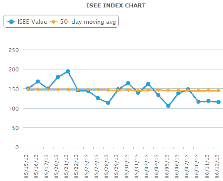

<!--yml
category: 未分类
date: 2024-05-18 16:16:06
-->

# VIX and More: ISEE Equities Only Index Prints Something Not Seen Since March 6, 2009

> 来源：[http://vixandmore.blogspot.com/2013/06/isee-equities-only-index-prints.html#0001-01-01](http://vixandmore.blogspot.com/2013/06/isee-equities-only-index-prints.html#0001-01-01)

[Put to call ratios](http://vixandmore.blogspot.com/search/label/put%20to%20call) are a permanent fixture in my indicator stable and something I have been writing about for a number of years, including an early 2007 effort, [A Sentiment Primer (Long)](http://vixandmore.blogspot.com/2007/03/sentiment-primer-long.html).

My perennial favorite of all the off-the-shelf put to call ratios actually inverts the traditional ratio: the [ISEE](http://vixandmore.blogspot.com/search/label/ISEE) equities only [call to put](http://vixandmore.blogspot.com/search/label/put%20to%20call) ratio. This ratio only counts opening options purchases and excludes index and ETF products so as to provide a more targeted approach to divining what sort of speculative trades retail investors are favoring.

What got my attention yesterday was that in reviewing the components of my proprietary Aggregate Market Sentiment Indicator ([AMSI](http://vixandmore.blogspot.com/search/label/AMSI)) for the [newsletter](http://vixandmoresubscriber.blogspot.com/), I saw that the ISEE equities only call to put ratio closed under 120 (meaning less than 120 opening call purchases per 100 opening put purchases) for three consecutive days for the first time since March 6, 2009 – the date when the SPX put in its post-crisis bottom at 666 and began what has now been a bull leg that has lasted more than four years.  Not surprisingly, this kind of hat trick is typically associated with conditions in which stocks are extremely oversold and ripe for a bounce, as appears to be the case today and was certainly the case in March 2009.

For the record, the ISEE equities only call to put ratio is back in the middle of its traditional range today, most recently at 178, as the financial markets are discovering some sort of normalcy – at least outside of the context of the Japanese yen.

The chart below shows the ISEE equities only call to put ratio, using closing values for the past month, as of yesterday’s close.

Note that the ISEE ratios come in two other flavors: an index that is limited to index and ETF transactions; and an all securities index which combines the equities only data and the index + ETF data. Current and historical data for all three versions of the ISEE call to put ratios, as well as an interactive chart, are available at the [ISEE Index page](http://www.ise.com/market-data/isee-index/).

For those who may be interested in learning more about put to call ratios, I have a larger than usual list of links below to jump start your research.

*[source(s): International Securities Exchange]*

Related posts:

***Disclosure(s):*** *none*