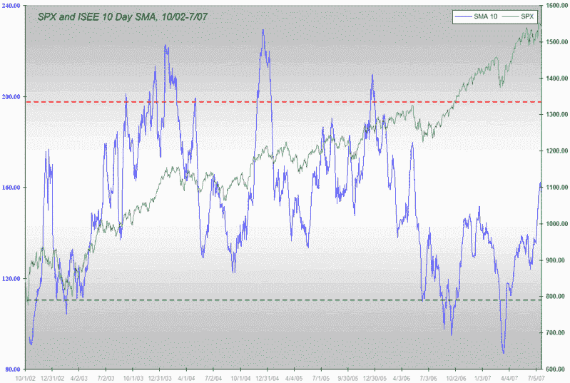
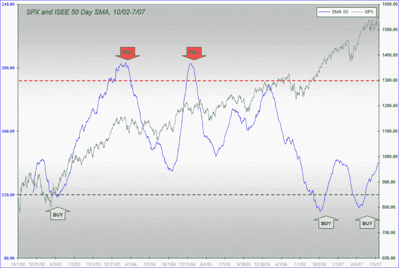

<!--yml
category: 未分类
date: 2024-05-18 19:06:12
-->

# VIX and More: ISEE Update

> 来源：[http://vixandmore.blogspot.com/2007/07/isee-update.html#0001-01-01](http://vixandmore.blogspot.com/2007/07/isee-update.html#0001-01-01)

I haven’t said much about the [ISEE](http://vixandmore.blogspot.com/search/label/ISEE) lately, largely because it hasn’t been saying much to me.  In my last call, on April 23^(rd), I [predicted the formation of a double bottom](http://vixandmore.blogspot.com/2007/04/isee-sma-50-double-bottom.html) in the ISEE’s 50 day SMA; that turned out to be exactly what happened, and if you have been long the markets in the past three months you have likely done very well.

Today, Babak at [Trader’s Narrative](http://www.tradersnarrative.com/) is [forecasting a turbulent market ahead](http://www.tradersnarrative.com/ise-sentiment-turbulence-ahead-for-the-market-1179.html), saying that because of a jump in the ISEE’s 10 day SMA, “for the next few days and weeks, the market may be heading into some kind of a short term top or choppy trading.”  He also offers up an [excellent chart](http://www.tradersnarrative.com/wp-content/uploads/2007/07/ise%20sentiment%20july%202007.png) to support that prediction.

While Babak is consistently one of my [favorite bloggers](http://vixandmore.blogspot.com/search?q=Babak), I am going to have to take the other side of his prediction.  First, I offer up my own chart of the ISEE’s 10 day SMA, along with the SPX, and take it back to the beginning the ISEE, almost five years ago.  As the chart below shows, the current level of the ISEE 10 day SMA is just about in the middle of the 5 year range, with readings of 200 or so better suited for calling market tops than the current 157.

My preferred ISEE SMA, the 50 day variant, still shows a relatively low level of call activity (recall that the ISEE is a *call to put* ratio, not the more common inverse) going back all the way to last summer’s correction. As shown in the chart below, April’s buy signal is still intact and does not look to be threatened in the near future, even though ISEE readings have been drifting decidedly higher as of late.

For what it's worth, the put to call ratio that [continues to concern me](http://vixandmore.blogspot.com/2007/06/cboe-put-to-call-ratio-poised-to-print.html) is the CBOE equity put to call ratio, but as I generally give precedence to the ISEE over the CBOE’s equity ratio, my concern is rather muted at this stage.