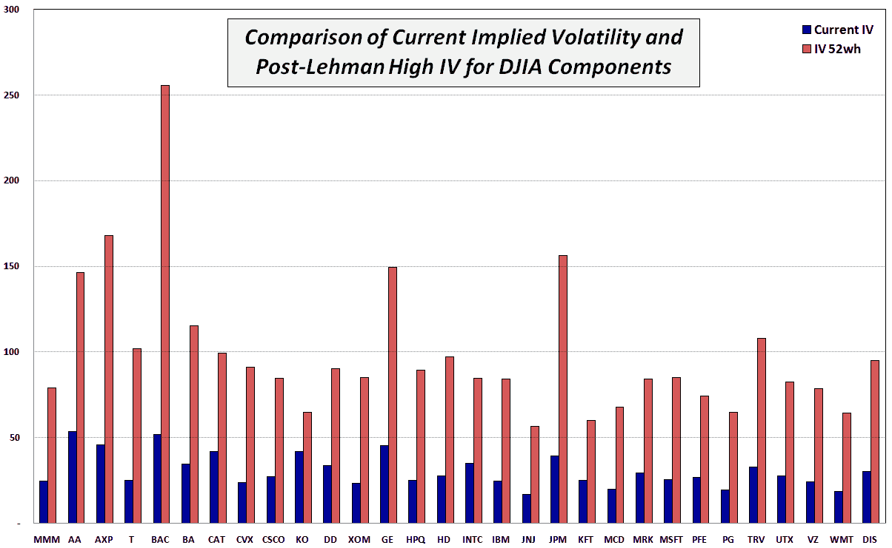

<!--yml
category: 未分类
date: 2024-05-18 17:30:02
-->

# VIX and More: Implied Volatility for the DJIA Components: Now vs. 52 Week Highs

> 来源：[http://vixandmore.blogspot.com/2009/09/implied-volatility-for-djia-components.html#0001-01-01](http://vixandmore.blogspot.com/2009/09/implied-volatility-for-djia-components.html#0001-01-01)

As the one year anniversary of the Lehman Brothers bankruptcy rolls around, I can imagine there will be very few celebratory parties.

I certainly have no desire to celebrate what turned out to be my second experience jumping out of an airplane, but I do want to make sure that some of the volatility data from that period are captured here for posterity. At some point in the future, some of us will want to look back and see just how crazy things got in during the historic volatility of October and November.

With this idea in mind, I have chosen to make this week’s [chart of the week](http://vixandmore.blogspot.com/search/label/chart%20of%20the%20week) a reflection on the current [implied volatility](http://vixandmore.blogspot.com/search/label/implied%20volatility) vs. the 52 week high IV of the 30 companies which comprise the Dow Jones Industrial Average. Of course the DJIA consists of some of the most financially sound companies in the world, so this exercise should highlight companies experienced a less severe impact due to the financial crisis than some of their more speculative peers. In fact, the numbers show that peak implied volatility for these blue chips was, on average, about 3.2 times higher than it is now. Even now, some of these numbers boggle the mind and make a VIX of 89.53 look almost pedestrian in comparison.

Note that Citigroup ([C](http://vixandmore.blogspot.com/search/label/C)) and [AIG](http://vixandmore.blogspot.com/search/label/AIG) were part of the DJIA when Lehman Brothers went bankrupt and subsequently had their membership from that select club revoked. For comparison purposes, consider that Citigroup’s implied volatility peaked at over 328 and currently sits at 66\. AIG, on the other hand, saw its implied volatility spike all the way up to 540\. It has since fallen to a more benign, but considerably elevated 135\. Progress? Perhaps…

*[source: International Stock Exchange]*