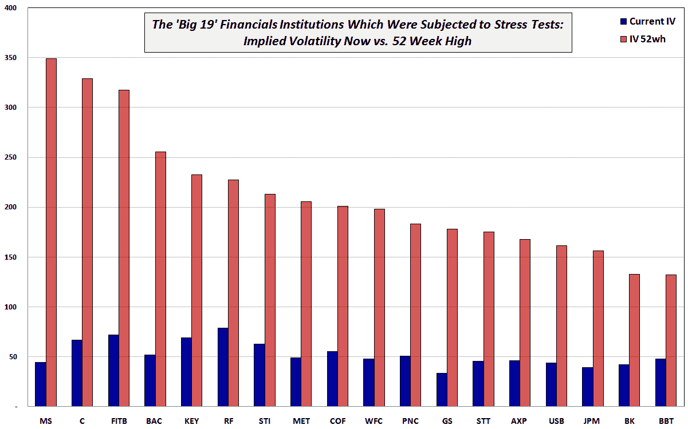

<!--yml
category: 未分类
date: 2024-05-18 17:29:41
-->

# VIX and More: Implied Volatility of 19 Large Financial Institutions: Now vs. 52 Week Highs

> 来源：[http://vixandmore.blogspot.com/2009/09/implied-volatility-of-19-large.html#0001-01-01](http://vixandmore.blogspot.com/2009/09/implied-volatility-of-19-large.html#0001-01-01)

Sunday’s [chart of the week](http://vixandmore.blogspot.com/search/label/chart%20of%20the%20week), which looked at [Implied Volatility of DJIA Components: Now vs. 52 Week High](http://vixandmore.blogspot.com/2009/09/implied-volatility-for-djia-components.html), received enough interest to warrant a follow-up that examines the current [implied volatility](http://vixandmore.blogspot.com/search/label/implied%20volatility) vs. the 52 week high IV of the 19 financial institutions which were subjected to the government stress tests. *[[link to stress test results](http://www.federalreserve.gov/newsevents/press/bcreg/bcreg20090507a1.pdf)]*

The chart below sorts the financial institutions from left to right according to their 52 week implied volatility highs, with GM omitted. While not captured in the graphic, I find it interesting that the two institutions whose current IV is the lowest compared to the high IV are Morgan Stanley ([MS](http://vixandmore.blogspot.com/search/label/MS)) at 12.7% of the 52 week high and Goldman Sachs ([GS](http://vixandmore.blogspot.com/search/label/GS)) at 18.9% of the 52 week high. Those institutions whose current IV is closest to the 52 week high (in percentage terms) are BB&T ([BBT](http://vixandmore.blogspot.com/search/label/BBT)) at 36.3% and Regions Financial ([RF](http://vixandmore.blogspot.com/search/label/RF)) at 34.6%.

So…going solely on the percentage retracement from implied volatility highs, it appears as if the investment banks are healthiest and have shed the most risk, while regional banks have undergone a much more measured healing process – about what one might expect. Clearly this is a story of multiple different pathways back to financial health.

*[source: International Stock Exchange]*