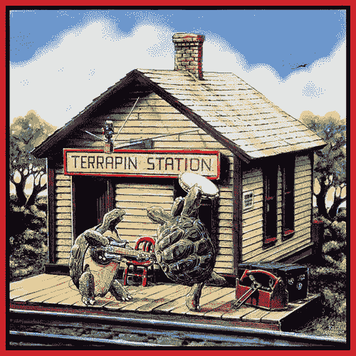

<!--yml
category: 未分类
date: 2024-05-18 18:44:15
-->

# VIX and More: Index Volatility and Component Correlation

> 来源：[http://vixandmore.blogspot.com/2008/02/index-volatility-and-component.html#0001-01-01](http://vixandmore.blogspot.com/2008/02/index-volatility-and-component.html#0001-01-01)

While I was sleeping soundly this morning, Adam at [Daily Options Report](http://adamsoptions.blogspot.com/2008/02/correlation-station.html) was already up and deconstructing the volatility of the S&P 500 index.  Drawing upon some data compiled by [Bespoke Investment Group](http://bespokeinvest.typepad.com/) that show [increasing correlation](http://bespokeinvest.typepad.com/bespoke/2008/02/correlation-tic.html) across the [S&P 500 sectors](http://vixandmore.blogspot.com/search/label/SPDRs) during the course of the past six months, Adam concludes that the current high levels of [index volatility](http://www.cboe.com/micro/volatility/introduction.aspx) (VIX, VXN, RVX, VXO, VXD) are due in part to this recent increase in correlation among the components of the S&P 500\.

In [Correlation Station](http://adamsoptions.blogspot.com/2008/02/correlation-station.html) (no relation to [Terrapin Station](http://en.wikipedia.org/wiki/Terrapin_Station)), Adam breaks it down as follows:

*“You can boil index volatility down to two basic factors. One is the volatility of the component stocks, the other is the correlation between those very stocks. And they can very much offset each other. Imagine a world where half the stocks were moving violently and basically trending in one direction, and the other half was moving violently the other way. Index volatility would be very low as the moves would pretty much offset each other.

What we have now is the opposite. Stocks aren't that cosmically volatile, but they are all moving in relative unison. Ergo index volatility is theoretically *high* relative to individual stock volatility.”*

There is not much I can do to improve upon that explanation.

While an understanding of the correlation phenomenon is important, I’m sure many are wondering if the current situation is tradeable.  For what little it is worth, I am not going to be taking trades that should be winners if correlations start unwinding, but I encourage those who are interested in this subject (yet another type of [mean reversion](http://vixandmore.blogspot.com/search/label/mean%20reversion) play) to check out Adam’s thinking about some [possible trades](http://adamsoptions.blogspot.com/2008/02/correlation-station.html) along these lines.