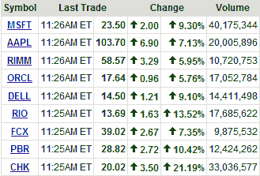

<!--yml
category: 未分类
date: 2024-05-18 18:21:34
-->

# VIX and More: Institutional Interest High in These Nine Large Caps

> 来源：[http://vixandmore.blogspot.com/2008/10/institutional-interest-in-high-in-these.html#0001-01-01](http://vixandmore.blogspot.com/2008/10/institutional-interest-in-high-in-these.html#0001-01-01)

 Stocks of all sizes and shapes are trading up today, but which ones will continue to do well if the market holds up?

In the graphic to the right (courtesy of Yahoo) I highlight nine large cap stocks that appear to be the biggest targets of institutional interest not just today, but when the markets moved up in spurts last week too. Those that made the cut did so on the basis of several price factors and several volume factors. The list consists of five technology names ([MSFT](http://finance.yahoo.com/q?s=msft), [AAPL](http://finance.yahoo.com/q?s=aapl), [RIMM](http://finance.yahoo.com/q?s=rimm), [ORCL](http://finance.yahoo.com/q?s=orcl), and [DELL](http://finance.yahoo.com/q?s=dell)), two mining/metals stocks ([RIO](http://finance.yahoo.com/q?s=rio), [FCX](http://finance.yahoo.com/q?s=fcx)), and two energy stocks ([PBR](http://finance.yahoo.com/q?s=pbr) and [CHK](http://finance.yahoo.com/q?s=CHK)). Interestingly, two of the nine companies are based in [Brazil](http://vixandmore.blogspot.com/search/label/Brazil).

At the very moment at least, these nine companies look to be at the top of the heap: quality stocks at attractive valuations, with considerable institutional interest. I would expect these names to continue to lead the way in subsequent bull moves.

Note that one company on this list may be somewhat of a special case. Chesapeake Energy (CHK) CEO Aubrey McClendon was [forced to sell “substantially all”](http://biz.yahoo.com/ap/081010/chesapeake_energy_ceo_stock.html?.v=2) of his 33 million shares last week to meet a margin call. With that forced selling completed, the stock is bouncing back today.