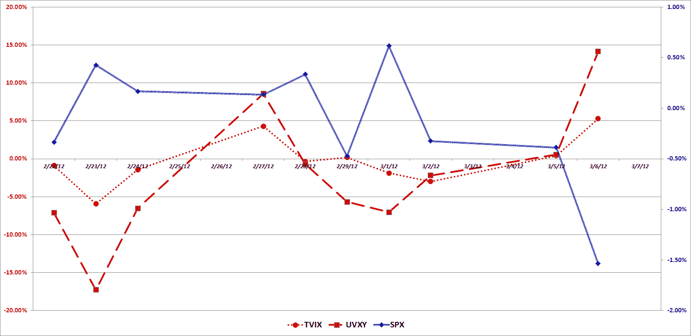

<!--yml
category: 未分类
date: 2024-05-18 16:36:37
-->

# VIX and More: Is TVIX Now Just a More Docile UVXY?

> 来源：[http://vixandmore.blogspot.com/2012/03/is-tvix-now-just-more-docile-uvxy.html#0001-01-01](http://vixandmore.blogspot.com/2012/03/is-tvix-now-just-more-docile-uvxy.html#0001-01-01)

Today is the eleventh trading day since Credit Suisse ([CS](http://vixandmore.blogspot.com/search/label/CS)) [announced](http://vixandmore.blogspot.com/2012/02/credit-suisse-suspends-creation-units.html) a suspension of new creation units in the VelocityShares Daily 2x VIX Short-Term ETN ([TVIX](http://vixandmore.blogspot.com/search/label/TVIX)) after the close of the regular trading session on February 21.

In the interim, all manner of investors, pundits, industry players and members of the media have attempted to grapple with the implications of this move for TVIX, for the broader class of [VIX exchange-traded products](http://vixandmore.blogspot.com/search/label/VIX%20ETN) (ETPs) and even for the [VIX futures](http://vixandmore.blogspot.com/search/label/VIX%20futures) market as a whole.

One of the more thought-provoking perspectives on TVIX and the VIX futures market came from Dave Nadig and Gene Koyfman of Index Universe in [Volatility ETFs Own All VIX Futures](http://www.indexuniverse.com/sections/features/11183-volatility-etfs-often-own-all-vix-futures.html?showall=&fullart=1&start=4), which I consider to be required reading. The potential implications of the VIX ETP tail wagging the VIX futures dog were nicely summarized by Izabella Kaminska of the Financial Times, wh0 wondered, [Time for Position Limits on VIX Futures?](http://ftalphaville.ft.com/blog/2012/03/05/908461/)

While I find the regulatory, exchange and internal risk management issues that have been raised by the TVIX creation units halt to be interesting fodder for contemplation, I am much more interested in understanding how the market disruptions have changed the manner in which some securities move and the trading implications of these changes.

In the graphic below, I have plotted the daily moves for TVIX, [UVXY](http://vixandmore.blogspot.com/search/label/UVXY) and the S&P 500 index over the course of the last ten trading days. In short, while it initially appeared as if TVIX was holding up much better than UVXY as the market declined, now it appears as if TVIX is also much more sluggish to the upside as well. While TVIX has outperformed UVXY during the last ten days, the most compelling explanation for disconnect between TVIX and UVXY is that the new market environment has substantially lowered TVIX’s beta. In other words, TVIX now lives more in the realm of (+1x) [VXX](http://vixandmore.blogspot.com/search/label/VXX) than (+2x) UVXY – and much closer to VXX at that. During the last ten trading days, UVXY has a 10-day historical volatility of 117, while VXX has a 10-day historical volatility of 60\. And TVIX? Well, during this period TVIX has been *even more docile than VXX*, with historical volatility reading of only 45.

For now at least, TVIX appears much less prone to spiking than I would have expected. This does not, however, rule out the possibility of a TVIX short squeeze sometime in the future. Buyers – and sellers – beware.

Related posts:

**

*[source(s): TD Ameritrade]*

***Disclosure(s):*** *short TVIX, UVXY and VXX at time of writing*