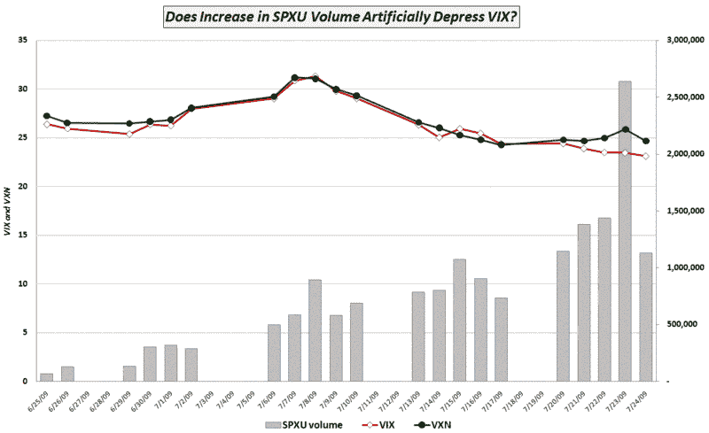

<!--yml
category: 未分类
date: 2024-05-18 17:36:39
-->

# VIX and More: Is VIX Being Artificially Depressed by Increased Use of SPXU?

> 来源：[http://vixandmore.blogspot.com/2009/07/is-vix-being-artificially-depressed-by.html#0001-01-01](http://vixandmore.blogspot.com/2009/07/is-vix-being-artificially-depressed-by.html#0001-01-01)

The continued drop in the VIX below the 25.00 level caught a number of traders by surprise, including this writer.

If one were to study last Friday’s [Forces Acting on the VIX](http://vixandmore.blogspot.com/2009/07/forces-acting-on-vix.html), it would not take long to determine that with very few exceptions, the fear and uncertainty associated with the forces in the graphic have been rapidly diminishing over the course of the past few months.

One of the forces that I mentioned has received very little attention and has likely been underestimated by traders – if accounted for at all. This is the growth of hedging substitutes for the SPX. As the VIX is strongly influenced by the demand for SPX puts, it stands to reason that any substitutes for SPX puts could ‘artificially’ lower VIX levels by diverting demand to alternative hedging products. Historically, these substitutes have included futures, options and various forms of swaps. With the increased interest in ETFs and particularly leveraged ETFs, however, the menu of substitutes has increased dramatically.

During the height of the financial crisis, [I documented](http://vixandmore.blogspot.com/2008/02/rising-popularity-of-xlf-options.html) how many investors were foregoing SPX and SPY puts in favor of options targeted specifically on the financial sector.

With the introduction of the bearish -3x Short ProShares ([SPXU](http://vixandmore.blogspot.com/search/label/SPXU)), a [triple ETF](http://vixandmore.blogspot.com/search/label/triple%20ETFs) aimed at replicating -300% of the daily move in the SPX, I believe traders have found – and embraced – an alternative to SPX options that is starting to impact the VIX.

The graphic below shows how the recent increased volume in the SPXU just happens to coincide with the decoupling of the VIX and the [VXN](http://vixandmore.blogspot.com/search/label/VXN). The same factors are undoubtedly impacting volatility term structure as well and may explain some of the recent low readings in the [VIX:VXV ratio](http://vixandmore.blogspot.com/search/label/VIX%3AVXV).

I am leaving the title of the graphic as a rhetorical question for the moment, as one month of data will necessarily leave us far short of any sort of statistical proof. Do not be surprised, however, if SPXU and its +3x sibling [UPRO](http://vixandmore.blogspot.com/search/label/UPRO) continue to generate larger interest and volume, both as a hedging tool and as a speculative play. As leveraged ETFs based on the SPX increase their market share, interest in SPX puts – and absolute levels in the VIX– may see a significant decline.

For some related posts, see:

*[graphic: VIXandMore]*