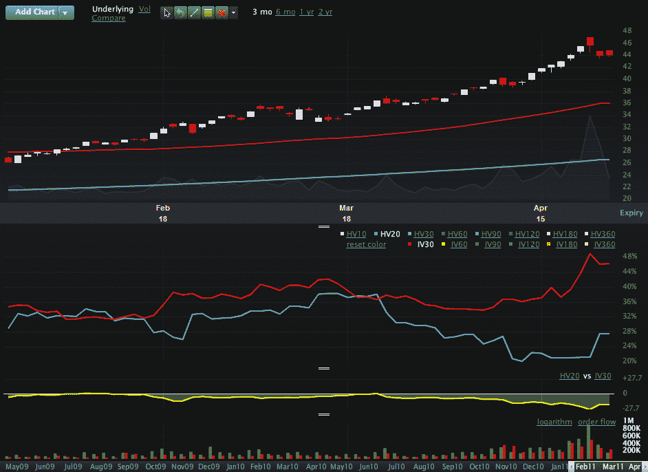

<!--yml
category: 未分类
date: 2024-05-18 16:50:51
-->

# VIX and More: Is Volatility a Better Play for Silver than Direction?

> 来源：[http://vixandmore.blogspot.com/2011/04/is-volatility-better-play-for-silver.html#0001-01-01](http://vixandmore.blogspot.com/2011/04/is-volatility-better-play-for-silver.html#0001-01-01)

It seems as if everyone in the world has an opinion about silver. Is it a bubble? Has it topped? Is it just consolidating before it goes to triple digits?

I have been trading silver directionally with a trend-following approach for many months, but recently exited all my long positions when I came to the decision that a top was imminent.

Still, silver looks way too attractive for me to sit on the sidelines, so now I am trading silver volatility instead of a directional play. The chart below from Livevol.com neatly illustrates my rationale.

Looking at the silver ETF, [SLV](http://vixandmore.blogspot.com/search/label/SLV), for the past six months, one cannot help but observe the ever-widening gap between [implied volatility](http://vixandmore.blogspot.com/search/label/implied%20volatility) and [historical volatility](http://vixandmore.blogspot.com/search/label/historical%20volatility) that has developed during the latter half of March. While it is certainly understandable that there is a great deal of uncertainty about the price of silver going forward, given the extreme recent volatility, I find it hard to believe that traders are betting silver will be about twice as volatile in the next month as it has been over the course of the last month.

For me this is a classic short volatility setup, with [straddles](http://vixandmore.blogspot.com/search/label/straddle), [strangles](http://vixandmore.blogspot.com/search/label/strangle), [butterflies](http://vixandmore.blogspot.com/search/label/butterfly) and [condors](http://vixandmore.blogspot.com/search/label/condor) looking to be pricing in an excessive amount of volatility. One need not necessarily structure those short volatility trades with the current price of SLV (about 44.18) at the midpoint of the spread. If one thinks silver has topped, why not sell a straddle at 43 or a strangle with a 40-45 spread? For now my focus is primarily a non-directional short volatility play, but one can also make a good case for a short volatility trade with a small directional twist, at least as I see it.

Of course, silver always presents some interesting pairs trading possibilities, typically with gold, but given the recent positive correlation between silver and stocks, an interesting approach is to look at short silver trades as a hedge for long equity positions.

Related posts:

*[graphic: Livevol Pro]*

****Disclosure(s):*** *neutral position in SLV via options at time of writing; Livevol is an advertiser on VIX and More**