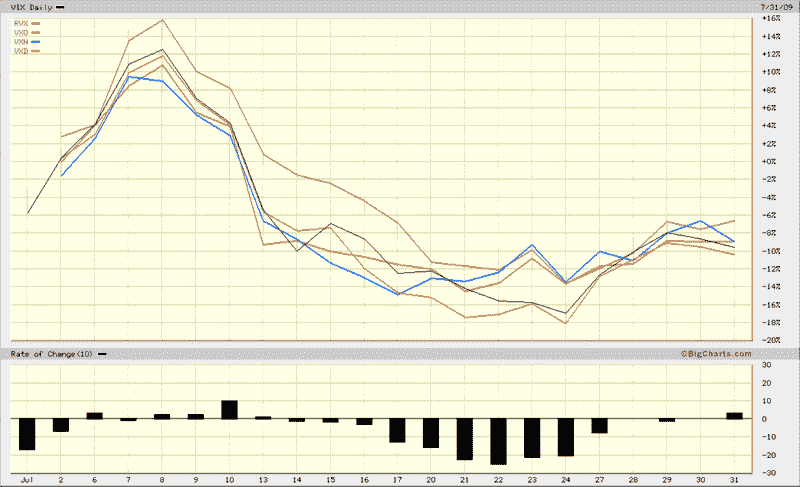
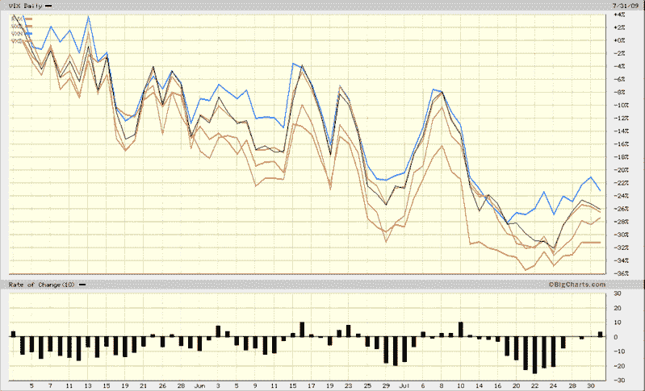

<!--yml
category: 未分类
date: 2024-05-18 17:35:54
-->

# VIX and More: Is the VIX Being Gamed?

> 来源：[http://vixandmore.blogspot.com/2009/07/is-vix-being-gamed.html#0001-01-01](http://vixandmore.blogspot.com/2009/07/is-vix-being-gamed.html#0001-01-01)

In [Fear Index Now Inverse to VIX](http://www.zerohedge.com/article/fear-index-now-inverse-vix), Zero Hedge recently put forth the idea that the VIX is “being gamed by volatility sellers” and may be “the most behind the scenes manipulated index.”

Several readers have asked me to comment on this. In short, I do not believe the VIX is being gamed to any significant extent. Among the volatility data I watch are the correlations across the various major volatility indices, including the VIX, [VXN](http://vixandmore.blogspot.com/search/label/VXN) (for the NASDAQ-100), [RVX](http://vixandmore.blogspot.com/search/label/RVX) (for the Russell 2000), [VXO](http://vixandmore.blogspot.com/search/label/VXO) (for the S&P 100 index) and [VXD](http://vixandmore.blogspot.com/search/label/VXD) (for the Dow Jones Industrial Average.) Historically, the lowest of these correlations has been the two market cap extremes, a 97% correlation between the RVX and the VXO. Frankly, I have not seen much of a deviation from historical patterns over the course of the past few weeks. The charts below show all five volatility indices over the course of the past one month (top) and three months (bottom). If there is any evidence to support the VIX as deviating from the other volatility indices, I don’t see it.

Note that because the VXO does not have any options or futures associated with it, gaming that volatility index would likely be the most difficult and expensive of the group. Also consider that because the components of the VXO have the largest market caps of any of the volatility indices, one would expect changes in the VXO to be less dramatic than those of the other indices that are populated by smaller and more volatile companies.

For related posts on the other secondary volatility indices, try:

*[source: BigCharts]*

***Disclosure****: Long VIX at time of writing.*