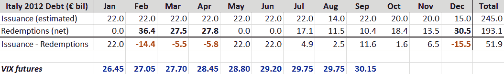

<!--yml
category: 未分类
date: 2024-05-18 16:45:01
-->

# VIX and More: Italy’s Sovereign Debt Schedule and the VIX

> 来源：[http://vixandmore.blogspot.com/2011/12/italys-sovereign-debt-schedule-and-vix.html#0001-01-01](http://vixandmore.blogspot.com/2011/12/italys-sovereign-debt-schedule-and-vix.html#0001-01-01)

When I think about the risks posed by the [European sovereign debt crisis](http://vixandmore.blogspot.com/search/label/European%20sovereign%20debt%20crisis) in 2012, the first thing that comes to mind is the huge amount of debt that [Italy](http://vixandmore.blogspot.com/search/label/Italy) has to roll over next year. In yesterday’s staff meeting/run with Logan ([What My Dog Can Tell Us About Volatility](http://vixandmore.blogspot.com/2007/01/what-my-dog-can-tell-us-about_947.html)) I even floated the semi-sexy label of “[peak refinancing](http://vixandmore.blogspot.com/search/label/peak%20refinancing).” He was not particularly impressed…

But I’m sure that somewhere under that calm demeanor, Logan too is worried about Italy and how well that pivotal country will manage the burden of refinancing. Of particular concern is that the refinancing schedule has a three month stretch from February through April in which the debt that is coming due is particularly large – €91.7 billion, just under half of the total redemptions for the entire year.

The table below summarizes the monthly estimates of Italy’s 2012 issuance ([per HSBC](http://www.research.hsbc.com/midas/Res/RDV?ao=20&key=GJ8vi0PuPs&n=311048.PDF)), as well as the schedule of redemptions and net issuance minus redemptions for each month.

In planning for the timing of elevated anxiety and perhaps a full-blown crisis in Europe in 2012, one would think that [Italy’s debt schedule](http://www.dt.tesoro.it/en/debito_pubblico/emissioni_titoli_di_stato_interni/) would figure prominently into those calculations. I would also expect to see some of that timetable translated into elevated [VIX futures](http://vixandmore.blogspot.com/search/label/VIX%20futures), which I have included at the bottom of the table below. In fact, the 2012 VIX futures [term structure](http://vixandmore.blogspot.com/search/label/term%20structure) is very similar to what it looked like prior to the August selloff, with no hint at all that volatility might peak in February, March or April.

When it comes to pricing options for 2012, keep Italy’s debt schedule in mind, regardless of whether the VIX futures are paying attention to this issue.

Related posts:

[source(s): Italy Department of Treasury, HSBC, Interactive Brokers]

***Disclosure(s):*** *none*