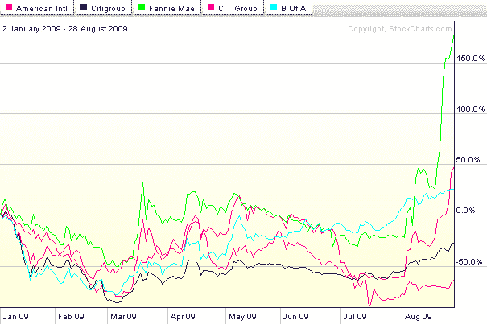
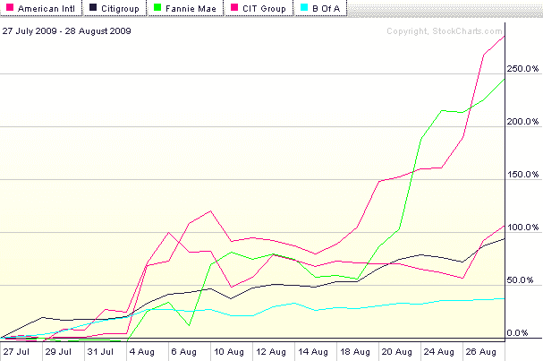

<!--yml
category: 未分类
date: 2024-05-18 17:31:27
-->

# VIX and More: JunkDEX Component Performance

> 来源：[http://vixandmore.blogspot.com/2009/08/junkdex-component-performance.html#0001-01-01](http://vixandmore.blogspot.com/2009/08/junkdex-component-performance.html#0001-01-01)

I am delighted to see that [JunkDEX Tracks Speculative Frenzy in Financials](http://vixandmore.blogspot.com/2009/08/junkdex-tracks-speculative-frenzy-in.html) and the [JunkDEX](http://vixandmore.blogspot.com/search/label/JunkDEX) itself appear to have hit a nerve and have generated such positive feedback.

To some extent, one could argue that the selection of the individual components of the JunkDEX was done in a somewhat arbitrary fashion and consequently, the performance of the index is somewhat biased by the hand-picked issues that tell a particular story.

I already mentioned the exclusion of Freddie Mac ([FRE](http://vixandmore.blogspot.com/search/label/FRE)), largely because the company’s business, financial history and stock performance is so similar to that of Fannie Mae ([FNM](http://vixandmore.blogspot.com/search/label/FNM)). I also looked at Lehman Brothers ([LEHMQ](http://vixandmore.blogspot.com/search/label/LEHMQ)), which gave us the [LEHVIX](http://vixandmore.blogspot.com/2008/06/lehvix.html), among other memories. LEHMQ was up 200% on Friday and is up another 50% so far today. I even toyed with the idea of General Motors ([MTLQQ](http://vixandmore.blogspot.com/search/label/MTLQQ)), but as both of these issues trade on the pink sheets, I did not want to venture into that netherworld.

For some historical context, I thought it would be helpful to provide some individual component performance charts for the JunkDEX. The first chart covers the full span of the JunkDEX, dating back to the beginning of 2009\. It shows particularly strong performance on the part of Fannie Mae and American International Group ([AIG](http://vixandmore.blogspot.com/search/label/AIG)):

The second chart reflects performance in each of the five components over the course of the last five weeks. Given the relatively short time frame for this data, I find the percentage changes to be even more interesting. While FNM and AIG are still the top performers, both Citigroup ([C](http://vixandmore.blogspot.com/search/label/C)) and CIT Group ([CIT](http://vixandmore.blogspot.com/search/label/CIT)) have doubled during this period. Bank of America ([BAC](http://vixandmore.blogspot.com/search/label/BAC)), which is weighted down by a market cap of $153 billion, is considerably less nimble, yet still has a gain of 37% in the past five weeks:

In today’s trading, AIG is down 11.5%, FNM is down 5.4% and only CIT is showing a gain.

*[graphics: StockCharts.com]* 

***[Disclosure: short AIG at time of writing]***