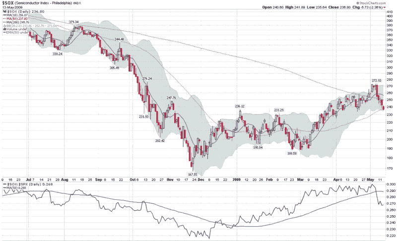

<!--yml
category: 未分类
date: 2024-05-18 17:47:36
-->

# VIX and More: Lagging Semiconductor Index Suggests Caution

> 来源：[http://vixandmore.blogspot.com/2009/05/lagging-semiconductor-index-suggests.html#0001-01-01](http://vixandmore.blogspot.com/2009/05/lagging-semiconductor-index-suggests.html#0001-01-01)

Last Wednesday, the NASDAQ-100 index ([NDX](http://vixandmore.blogspot.com/search/label/NDX)), which had been relatively weak compared to the SPX, put in a top and began to decline. The weakness in the NDX was one of the reasons I wondered aloud [SPX 915 As a Top?](http://vixandmore.blogspot.com/2009/05/spx-915-as-top.html) – only to discover that while I had indeed found a top, it was in the NDX, not in the S&P 500.

On Thursday, the Philadelphia Semiconductor Index, also known as the [SOX](http://vixandmore.blogspot.com/search/label/SOX), put in a top of its own before reversing hard and declining precipitously. The SOX ended the day down 5.6% and dragged down the NDX and the rest of the technology sector with it. Technology has been in a tailspin ever since the steep drop in the SOX.

The banks were successful in keeping the broader markets in a bullish mode on Friday without the help of the SOX and technology (see [The Banks vs. Technology](http://vixandmore.blogspot.com/2009/05/banks-vs-technology.html)), but starting on Monday, the weakness in technology began to spread to other sectors, even the financials.

The SOX has long been considered a leading indicator, not just for technology firms but also for the market in general. Semiconductors are early cycle technology stocks and an unhealthy semiconductor sector does not bode well for economic recovery.

Going forward, a healthy rally should include the participation of semiconductors, as measured by the SOX and ETFs such as [SMH](http://vixandmore.blogspot.com/search/label/SMH). In an ideal rally, semiconductors should show strong absolute gains and also outperform the SPX on a relative basis. Until we see more strength from semiconductors, I am likely to have a bearish bias.

*[source: StockCharts]*