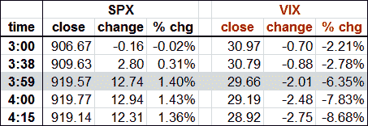

<!--yml
category: 未分类
date: 2024-05-18 17:45:26
-->

# VIX and More: Late Day Rallies, the SPX and the VIX

> 来源：[http://vixandmore.blogspot.com/2009/05/late-day-rallies-spx-and-vix.html#0001-01-01](http://vixandmore.blogspot.com/2009/05/late-day-rallies-spx-and-vix.html#0001-01-01)

Today was an interesting trading day, particularly during the last hour of equity trading.

The graphic at the bottom records (in Pacific Time) the intraday movements in the VIX, which was essentially flat for all but the first hour and the last 22 minutes of trading. At 3:00 p.m. ET, the VIX stood at 30.97, down 0.70 (-2.21%) from yesterday’s close. At that same moment, the SPX was at 906.67, down 0.16 (-0.02%) for the day.

The SPX began a slow and steady rise at the beginning of the last hour of trading, with the VIX gradually pulling back. The table below captures the changes in the VIX and SPX during that last hour. Note that the VIX, whose values are updated every 15 seconds, begins to move sharply at 3:38, then creates the first of several gaps at 3:41\. By 3:59, one minute before NYSE trading closes, the VIX has moved about 4.5x of the percentage change in the SPX, in the opposite direction. At 4:00 the stocks that comprise the SPX stop trading. The daily high of 920.02 for the SPX was recorded in the minute that followed, as some trade data trickled in after the bell. During the two minutes after the close, the SPX was revised down in small increments several times, before being finalized at 4:11.

While the individual components of the SPX stop trading at 4:00, SPX index options trade for an additional 15 minutes in what I like to refer as the

[twilight zone](http://vixandmore.blogspot.com/search/label/twilight%20zone)

trading period. This can lead to some interesting VIX prints, particularly if there is a strong move in the SPX toward the end of the regular trading session or if important news breaks during the 15 minute twilight zone. What apparently happened today is that the supply of SPX options overwhelmed demand in the last few minutes of the regular trading session and carried over into the 15 minutes of index options trading. By the time the VIX was finalized, at 4:15 p.m. ET, it had fallen all the way to 28.92, a move that was 6.4x the percentage change of the SPX, in the opposite direction.

Normally, when one sees a dramatic change in the ratio of the VIX to SPX percentage moves, this is indicative of a substantial imbalance in the supply and demand equation for SPX options.

As a side note, those who are analyzing historical VIX and SPX data should be aware that the different cutoff times can occasionally lead to some unusual data anomalies.

For additional information, check out a related post on this subject from January:

[VIX (and VXN) After Hours](http://vixandmore.blogspot.com/2009/01/vix-and-vxn-after-hours.html)

.

*[source: thinkorswim]*