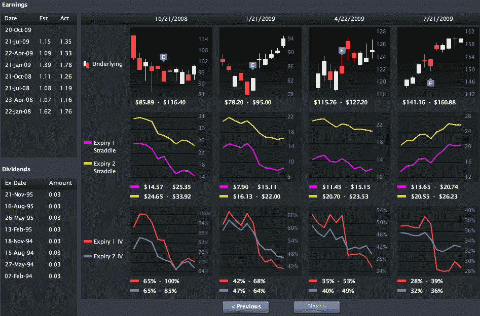

<!--yml
category: 未分类
date: 2024-05-18 17:29:52
-->

# VIX and More: Livevol Pro: A World Class Suite of Volatility Tools

> 来源：[http://vixandmore.blogspot.com/2009/09/livevol-pro-world-class-suite-of.html#0001-01-01](http://vixandmore.blogspot.com/2009/09/livevol-pro-world-class-suite-of.html#0001-01-01)

Long-time readers will know that when it comes to charts of [implied](http://vixandmore.blogspot.com/search/label/implied%20volatility) and [historical volatility](http://vixandmore.blogspot.com/search/label/historical%20volatility), I have a preference for using free charts from the [International Securities Exchange](http://www.ise.com/WebForm/md_livevol.aspx?categoryId=124&header2=true&menu1=true) (ISE) and [iVolatility.com](http://www.ivolatility.com/options.j?ticker=SPX:CBOE&R=1&period=12&chart=2&vct=). In fact, when I started using the [ISE Implied Volatility Charts](http://vixandmore.blogspot.com/2008/03/ise-implied-volatility-charts.html) on a regular basis about 1 ½ years ago, I was literally bombarded with requests for information about how readers could create their own charts.

Last November, I chronicled some enhancements to the ISE’s charts in [International Securities Exchange Revamps Implied Volatility Charts](http://vixandmore.blogspot.com/2008/11/international-securities-exchange.html) and eventually went on to recognize these charts as the *Best New Free Volatility Tool* in the inaugural *VIX and More* [2008 Volatility Awards](http://vixandmore.blogspot.com/2009/01/2008-volatility-awards.html).

I mention all of this because the company that developed the ISE volatility charts, [Livevol](http://www.livevol.com/), recently released a new suite of options tools that has now become my personal favorite for volatility and options analytics. Called [Livevol Pro](http://www.livevol.com/RealtimeAnalysis.aspx), the web-based application was developed by professional traders for both professional and retail investors.

I am glad to have had a chance to spend several weeks with the beta version and was delighted to see Livevol Pro come out of beta this week. If you have an interest in volatility, at the very least you should check out the [5 minute demo movie](http://www.livevolpro.com/help/movies/all_movie_short/all_movie_short.html) or the more extensive [demo of the full set of features](http://www.livevolpro.com/help/movies/all_movie/all_movie.html) to see what the product has to offer. Among my favorite features are:

*   A company tab that displays a comprehensive overview of options data for a selected company/ETF/index, including: implied volatility and historical volatility percentile ranks relative to the last 52 weeks of data; percentage of put and call transactions bought on the ask and sold on the bid; and much more
*   An options tab which displays real-time streaming options quotes and implied volatility data – which quickly transitions to level II quotes with built-in options charts
*   Options time and sales data which can be filtered by strike, trade size, exchange and date. Included are two years of historical options time and sales transactions.
*   A powerful scanning tool with 22 built-in scans that include a number of ways to slice and dice implied volatility, compare IV to HV, track order flow (volume, open interest, ISE sentiment), flag important price changes, and uncover some interesting time spread setups
*   Last but not least is a nifty earnings tool that offers two years of a visual history of price and implied volatility changes in the underlying around earnings releases. In the screen capture below, you can see that each earnings period includes five days before and after the earnings release. The graphics track price changes in the underlying ([APPL](http://vixandmore.blogspot.com/search/label/APPL) in this instance) on the top row, changes in the value of a straddle position for the front month and second month in the middle row, and changes in implied volatility in the front month and second month in the bottom row

I will be featuring some Livevol Pro graphics and content in this space going forward, but wanted to inform readers about this application, now that it has gone live and is available to the general public. When it comes to options, everyone has their own ideas of what information is important, but for me, Livevol Pro is everything I want, all in one place, and for only $100 per month.

For those who may be interested, Livevol also has a [free version](http://www.livevol.com/SignUpLanding.aspx) of the application available with end of day data that updates after the market close.

For more information, readers are encouraged to visit [http://www.livevol.com](http://www.livevol.com/).

*[graphics: Livevol Pro]*