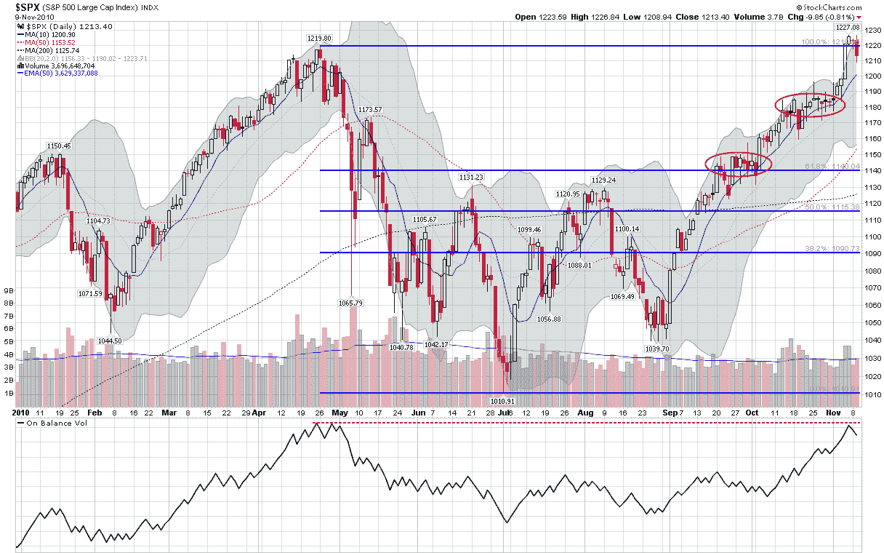

<!--yml
category: 未分类
date: 2024-05-18 16:59:07
-->

# VIX and More: Looking for SPX Support Levels

> 来源：[http://vixandmore.blogspot.com/2010/11/looking-for-spx-support-levels.html#0001-01-01](http://vixandmore.blogspot.com/2010/11/looking-for-spx-support-levels.html#0001-01-01)

After topping out at a new two-year high of just over 1227 on Friday, the S&P 500 index has begun to show some signs of vulnerability this week, falling 1.5% from that top to the 1208 level today.

I generally think of pullbacks as being meaningful only when they span at least 3% from peak to trough, so assuming the bulls will not continue to drive stocks higher day after day, it is certainly worth considering what sort of support the SPX may have.

The first candidate for support now stands at today’s low of SPX 1208\. After that, the psychologically significant 1200 level looms large, particularly since it also acted as the last base before the index soared to a new high. Below 1200, finding support is not as easy.

The chart below highlights two areas of congestion marked in red ovals. The higher one is defined by the 1175-1185 level, where stocks consolidated for about three weeks before moving higher. The lower area of congestion sits in the 1140-1150 range, just above a key Fibonacci support level and reflects the range-bound trading during the second half of September. Below this area on the chart, we encounter residual support levels at 1130 and below from the May to September trading range.

A pullback of 3% would bring the SPX back to about 1190, so I would expect the 1175-1185 to be a critical support level and perhaps the line of demarcation between a minor pullback and a bearish counter trend. Of course the bears have not been able to muster any semblance of bearish momentum since August. but given that the SPX tacked on 187 points (18%) almost without interruption in the interim, the possibility that the next move down could be a sharp one cannot be discounted.

Those concerned about the possibility of a double top should also consider that the On Balance Volume indicator is also pointing to the possibility of a double top. Finally, with the VIX in the low 19s, VIX calls can provide relatively inexpensive portfolio insurance at this juncture, just in case the bulls start to have some second thoughts.

Related posts:

***Disclosure(s):*** *none*

**[source: StockCharts.com]**