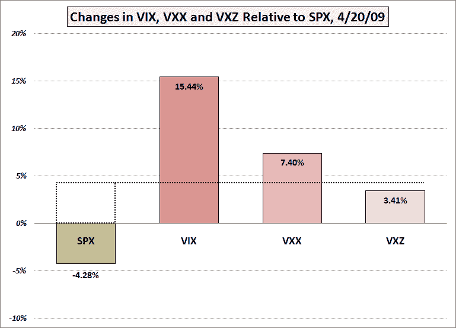

<!--yml
category: 未分类
date: 2024-05-18 17:51:02
-->

# VIX and More: Lost in Translation: VXX and VXZ

> 来源：[http://vixandmore.blogspot.com/2009/04/lost-in-translation-vxx-and-vxz.html#0001-01-01](http://vixandmore.blogspot.com/2009/04/lost-in-translation-vxx-and-vxz.html#0001-01-01)

Partly based on some thinking I laid out last week in [Some VIX Milestones…and a Prediction](http://vixandmore.blogspot.com/2009/04/some-vix-milestonesand-prediction.html), I was fortunate to be long [VXX](http://vixandmore.blogspot.com/search/label/VXX), the iPath S&P 500 VIX Short-Term Futures ETN, going into yesterday’s session.

VXX notched a nice one day gain of 7.40%, but this was less than half of the 15.44% gain in the VIX. On the other hand, [VXZ](http://vixandmore.blogspot.com/search/label/VXZ), iPath S&P 500 VIX Mid-Term Futures ETN, which targets VIX futures approximately five months out, moved a mere 3.41%, less than half of VXZ. As shown in the chart below, VXZ’s jump did not even match that of the 4.28% drop in the SPX.

All things considered, these are about the percentage moves relative to the VIX that one should expect. I have previously discussed the relative [juice factor](http://vixandmore.blogspot.com/search/label/VXX%20juice%20factor) in [VXX Data Now Painting an Accurate Picture](http://vixandmore.blogspot.com/2009/03/vxx-data-now-painting-accurate-picture.html) and elsewhere, but apparently not everyone has internalized this information yet. Further, if you follow any of the [term structure](http://vixandmore.blogspot.com/search/label/term%20structure) discussions here, the volatility predictions as a function of months into the future is a recurring theme.

With almost three months of data to draw upon, VXX is now averaging close to 50% of the daily move in the VIX and VXZ is averaging approximately 20% of the daily move in the VIX. The bottom line is that if you are looking for the type of moves generated by the cash VIX, your best bets are [VIX options](http://vixandmore.blogspot.com/search/label/VIX%20options), VIX futures or a 2x leveraged play on VXX.

Personally, I find VIX options to generally be the most attractive way to trade the VIX, given their liquidity and the flexibility inherent in structuring a wide range of options positions.

*[graphic: VIXandMore]*

 ****Disclosure****: Long VXX at time of writing.**