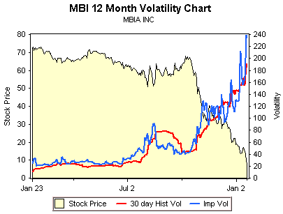

<!--yml
category: 未分类
date: 2024-05-18 18:46:24
-->

# VIX and More: MBI, Bond Insurers, and Volatility

> 来源：[http://vixandmore.blogspot.com/2008/01/mbi-bond-insurers-and-volatility.html#0001-01-01](http://vixandmore.blogspot.com/2008/01/mbi-bond-insurers-and-volatility.html#0001-01-01)

One of the more interesting – and important – subplots to keep an eye on during the current market difficulties is that of the bond insurers.  The two most prominent of these bond insurers, [MBIA (MBI)](http://finance.google.com/finance?q=mbi) and [Ambac (ABK)](http://finance.google.com/finance?q=abk), are in the news today with reports that the New York Insurance Superintendent is trying to arrange a [capital infusion](http://www.bloomberg.com/apps/news?pid=20601103&sid=akJnQGtVt6uU&refer=us) from the likes of [Goldman Sachs (GS)](http://finance.google.com/finance?q=gs), [Merrill Lynch (MER)](http://finance.google.com/finance?q=mer), [JPMorgan (JPM)](http://finance.google.com/finance?q=jpm), [Citigroup (C)](http://finance.google.com/finance?q=c), and [Wachovia (WB)](http://finance.google.com/finance?q=wb).  Presumably, the Fed is doing some arm twisting and offering some financial incentives behind the scenes, as a failure to resolve the problems with the bond insurers would likely trigger systemic havoc and involve a long and expensive list of dominoes in the process.

Eric Dinallo, the New York Insurance Superintendent, was [quoted earlier today](http://www.marketwatch.com/News/Story/Story.aspx?guid=%7b6806DD6D-C4DF-48A6-BB10-47660A9840E5%7d&siteid=yhoo&dist=yhoo) as saying that while a rapid resolution is essential, ironing out the details of a bailout may take awhile.  “It is important to resolve issues related to the bond insurers as soon as possible,” Dinallo noted, while cautioning “these are complicated issues involving a number of parties and any effective plan will take some time to finalize.”

While most investors should be thinking about the bond insurer issue in terms of its impact on the broader markets, there are some interesting plays on bond issuers themselves.  As reported in [24/7 Wall Street](http://www.247wallst.com/), Goldman Sachs laid out some [potential valuations](http://www.247wallst.com/2008/01/goldman-sachs-v.html) under three different scenarios, ranging from the bond insurers’ being unable to raise enough capital to mollify the rating agencies to a situation where the capital raised enables the bond insurers to continue to operate as they had in a pre-crisis mode.  Looking just at MBI, the valuation spread ranges from $6 to $48.

Investments don’t get much more speculative than this, as the chart from optionsXpress above shows.  For the record, all February puts now carry an implied volatility of more than 200.  While I am not going to recommend a specific trade here, there are some fascinating options spreads and [ratio spreads](http://www.optionsxpress.com/educate/strategies/ratiospreads.aspx) to look at for those who believe that the Goldman scenarios and numbers are in the ballpark.