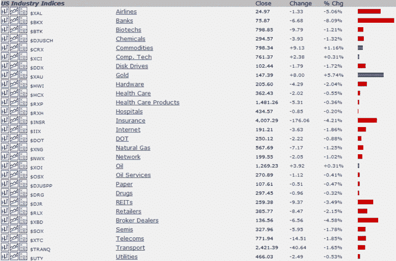

<!--yml
category: 未分类
date: 2024-05-18 18:25:32
-->

# VIX and More: Market 2.0

> 来源：[http://vixandmore.blogspot.com/2008/09/market-20.html#0001-01-01](http://vixandmore.blogspot.com/2008/09/market-20.html#0001-01-01)

So far we are 1 ½ hours into Market 2.0 and the picture looks like a throwback to earlier in the year. Gold, oil and commodities in general are in the green and almost every other sector is in the red, with financials, airlines, and real estate logging the largest losses.

The chart below, courtesy of [StockCharts.com](http://stockcharts.com/), details U.S. [sector](http://vixandmore.blogspot.com/search/label/sectors) performance through 11:00 a.m. EDT. If the sector performance looks familiar, it could be that the trends bear a strong resemblance to those I recorded back on January 1^(st) in [Sector Clues in First Hour of 2008?](http://vixandmore.blogspot.com/2008/01/sector-clues-in-first-hour-of-2008.html)

