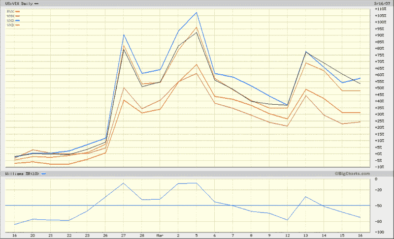

<!--yml
category: 未分类
date: 2024-05-18 15:53:48
-->

# VIX and More: Meet the Spikers

> 来源：[http://vixandmore.blogspot.com/2007/03/meet-spikers_16.html#0001-01-01](http://vixandmore.blogspot.com/2007/03/meet-spikers_16.html#0001-01-01)

Quadruple witching day seems like as good a day as any to meet the family.  Having already introduced [VDAX](http://vixandmore.blogspot.com/search/label/VDAX), the VIX’s German cousin, today we look at the <place st="on"><country-region st="on">US</country-region></place> relatives.  First, the handy chart:

Due to marriages, divorces, name changes and the like, a more detailed look at the <country-region st="on"><place st="on">US</place></country-region> extended family can get complicated, but here are the five key players, roughly in order of their current significance in the markets:

**[VIX](http://www.cboe.com/micro/vix/introduction.aspx)** – measures implied volatility for [S&P 500](http://www2.standardandpoors.com/portal/site/sp/en/us/page.topic/indices_500/2,3,2,2,0,0,0,0,0,0,0,0,0,0,0,0.html) (SPX) options for all near term at-the-money SPX puts and calls and out-of-the-money puts and calls. Deep-in-the-money options are excluded. The current methodology has been in use since 9/22/03.  The VIX was officially introduced on 4/1/93, but the [CBOE](http://www.cboe.com/) has calculated synthetic historical VIX data going back to the beginning of 1990.

**[VXN](http://www.cboe.com/micro/vxn/)** – measures implied volatility for the [Nasdaq 100](http://dynamic.nasdaq.com/dynamic/nasdaq100_activity.stm) (NDX) options for all near term at-the-money NDX puts and calls and out-of-the-money puts and calls. Deep-in-the-money options are excluded.  The current methodology has been in use since 9/22/03; the index was originally introduced on 1/22/01.

**[VXO](http://www.cboe.com/micro/vxo/)** – is calculated by taking the weighted average of the implied volatility of 8 [S&P 100](http://www2.standardandpoors.com/portal/site/sp/en/us/page.topic/indices_100/2,3,2,2,0,0,0,0,0,0,0,0,0,0,0,0.html) OEX calls and puts with an average time to expiration of 30 days. Note that this is the methodology that was used to calculate the VIX prior to 9/22/03.  On that date, the method used to calculate the VIX was changed and a new ticker symbol and name was introduced to provide continuity with the historical method of calculating the "old VIX" prior to 9/22/03.

From the CBOE site:

*"VIX measures market expectation of near term volatility conveyed by stock index option prices. The original VIX was constructed using the implied volatilities of eight different OEX option series so that, at any given time, it represented the implied volatility of a hypothetical at-the-money OEX option with exactly 30 days to expiration.*

*The New VIX still measures the market's expectation of 30-day volatility, but in a way that conforms to the latest thinking and research among industry practitioners. The New VIX is based on S&P 500 index option prices and incorporates information from the volatility ‘skew’ by using a wider range of strike prices rather than just at-the-money series."*

**[VXD](http://www.cboe.com/micro/vxd/)** – measures implied volatility for the [Dow Jones Industrial Average](http://www.djindexes.com/mdsidx/?event=showAverages) options for all near term at-the-money DJIA puts and calls and out-of-the-money puts and calls.  Deep-in-the-money options are excluded.  Introduced on 4/25/05.

**[RVX](http://www.cboe.com/micro/rvx/)** – measures implied volatility for the [Russell 2000](http://www.russell.com/indexes/characteristics_fact_sheets/US/Russell_2000_Index.asp) (RUT) options for all near term at-the-money NDX puts and calls and out-of-the-money puts and calls. Deep-in-the-money options are excluded.  Introduced on 5/5/06.

While there is a very high degree of correlation among the volatility indices, like any family, this family does not always move in lockstep fashion, as the graph below demonstrates.  In the coming weeks, I will talk more about divergence among the volatility indices and attempt to provide a framework for interpreting them.

