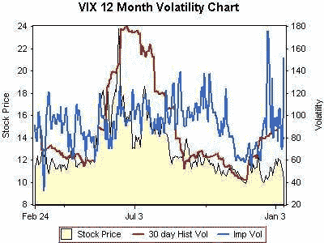

<!--yml
category: 未分类
date: 2024-05-18 16:02:34
-->

# VIX and More: Meta Volatility (...or IV^2?)

> 来源：[http://vixandmore.blogspot.com/2007/01/metavolatility-or-iv2.html#0001-01-01](http://vixandmore.blogspot.com/2007/01/metavolatility-or-iv2.html#0001-01-01)

So...the VIX is a measure of implied volatility and the VIX has options. Those options also have implied volatility. So...what the heck is the implied volatility of implied volatility and what does it mean?

First, the easy part.

So, there you have it. A year of implied volatility of implied volatility.

Some quick observations on what it might mean before I take a sharper analytical knife to the data:

1\. High correlation between VIX price and 30 day historical volatility (no surprise)

2\. A couple of interesting large IV spikes in the past month that are atypical

3\. Recent divergence between IV and VIX price trend is unusual

4\. VIX IV appears to have averaged around 100 in the past year

5\. IV downward spikes in the 60-70 range were short-lived and appear to have provided a couple of good buy signals

6\. VIX IV is

not

the rate of change of the VIX -- and the lack of correlation to same is striking, at least to me