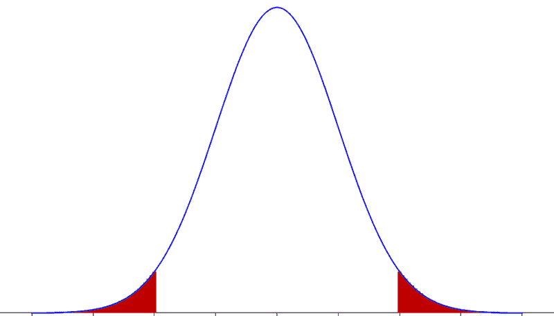

<!--yml
category: 未分类
date: 2024-05-18 17:37:25
-->

# VIX and More: More Questions About Bollinger Bands

> 来源：[http://vixandmore.blogspot.com/2009/07/more-questions-about-bollinger-bands.html#0001-01-01](http://vixandmore.blogspot.com/2009/07/more-questions-about-bollinger-bands.html#0001-01-01)

Yesterday’s post, [StockCharts.com Charts on the Blog](http://vixandmore.blogspot.com/2009/07/stockchartscom-charts-on-blog.html), triggered several questions from readers about the nature of the [Bollinger Bands](http://vixandmore.blogspot.com/search/label/Bollinger%20bands) data and the usefulness of these bands to traders.

One reader asked whether I intended to say that the two standard deviations should contain 95.45%. While this is what would expect from a Gaussian or [normal distribution](http://en.wikipedia.org/wiki/Normal_distribution), the distribution of stock prices does not follow a normal distribution. In fact, they tend to have fat tails or what statisticians call positive [kurtosis](http://en.wikipedia.org/wiki/Kurtosis).

In [Bollinger on Bollinger Bands](http://www.amazon.com/Bollinger-Bands-John/dp/0071373683/ref=sr_1_1?ie=UTF8&s=books&qid=1248306828&sr=1-1), John Bollinger talks about the extensive research he did which demonstrated that Bollinger Bands do not capture as much of the data as would be expected from statistics associated with a normal distribution.

Bollinger describes his findings as follows:

> “*Only approximately 89 percent of the data is contained within 2 standard deviation bands when we would expect 95 percent.* 
> *There are two possible reasons why we don't get as high as a level of containment as we would expect -- near 95 percent with 2 standard deviation bands. First, we are using the population calculation, which results in slightly tighter bands than the sample calculation. Second, the distribution of stock prices is not normal -- there are more observations at the extremes than one would expect -- so there are more data points outside the bands too. There are undoubtedly more factors, but these appear to be the main ones.”*

 *Another reader offered the following critique of Bollinger Bands:

> *“I've never understood the value of Bollinger bands. They don't provide a measure of volatility since as the chart gets more volatile the bands expand. One might look at the width of the band to estimate volatility. But that seems like a very imprecise measure. It doesn't really stand out. A graph of historical volatility would be much more useful.
> 
> Nor do they help with estimating when regression to the mean might occur. For again, as the item moves farther from the mean, the bands expand. There are many instances in which the chart touched the extreme of the band only to continue on farther -- with the band following along.”*

While not trying to sound like an apologist for Bollinger Bands, it is important to note that these are one way of measuring [historical volatility](http://vixandmore.blogspot.com/search/label/historical%20volatility) (albeit not the standard approach) and they have the benefit of providing a visual shorthand for those who wish to eyeball the ebb and flow of relative volatility.

In fact, [Bollinger Band width](http://vixandmore.blogspot.com/search/label/Bollinger%20band%20width) is a way to measure one type of historical volatility statistically rather than to rely on a chart and I have used this measure on the blog (see link above for examples) on several occasions to measure volatility.

Regarding predictive value of Bollinger Bands, I find that they can be a useful indicator – notably with the VIX – and increase in their predictive the more standard deviations the VIX is from the mean. While October and November 2008 were not good times to employ this strategy, for the most part, I believe Bollinger Bands usually provide some helpful information about the likelihood of mean reversion.

Finally, there are some traders who prefer to play the volatility trend instead of using a mean reversion approach. Volatility trend traders might do something opening and maintaining long positions when a stock is trading between +1.0 and +2.0 standard deviations above the mean and closing those positions when the Bollinger Band lines are violated.

For those who are interested in learning more about Bollinger Bands, Bollinger’s own book on the subject (see above) is a probably the last word on the matter. Readers are also encouraged to check out a three-part series on three important parameters of Bollinger Bands that I posted a little over a year ago:

1.  [Bollinger Bands: Why 20 Days?](http://vixandmore.blogspot.com/2008/06/bollinger-bands-why-20-days.html)
2.  [Bollinger Bands and the Standard Deviation Setting](http://vixandmore.blogspot.com/2008/06/bollinger-bands-and-standard-deviation.html)
3.  [Bollinger Bands and the Percent B Setting](http://vixandmore.blogspot.com/2008/06/bollinger-bands-and-percent-b-setting.html)

*