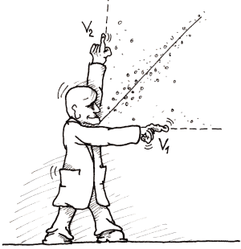

<!--yml
category: 未分类
date: 2024-05-18 18:58:11
-->

# VIX and More: More Thoughts and Numbers on the SPX-VIX Correlation

> 来源：[http://vixandmore.blogspot.com/2007/10/more-thoughts-and-numbers-on-spx-vix.html#0001-01-01](http://vixandmore.blogspot.com/2007/10/more-thoughts-and-numbers-on-spx-vix.html#0001-01-01)

I have used this space to talk about the [correlation between the VIX and SPX](http://vixandmore.blogspot.com/search/label/SPX-VIX%20correlation), the [SPX:VIX ratio](http://vixandmore.blogspot.com/search/label/SPX%3AVIX) and an bunch of other related subjects.  Some may be ready to scream “Enough already!” but now it’s time we *really* got serious about the subject.

Let’s start with yesterday.  There was a lot of talk (if you travel in certain blogging circles, at least) about how unusual it was for the SPX to jump 1.33% while the VIX moved down only 0.89%.  The contention that the move on the part of the VIX was rather tepid seems to make sense in theory, because it is ‘common knowledge’ that the VIX typically moves in the opposite direction of the SPX and at a much faster rate.  Where are the numbers to support this belief?  Well, I’m going to start trotting them out in this space, but not all at once, so that I everyone has a chance to move to higher ground before the flood hits.

Some numbers to contemplate, using data from 1990:

*   The VIX and the SPX move in the opposite direction on 76% of all trading days
*   On those days the VIX and SPX move in the same direction, the move is more likely to be up than down
*   In percentage terms, the median daily move in the VIX is -4.2x the daily move in the SPX

Getting back to yesterday, the SPX has risen 1.33% on seven previous instances.  On all seven occasions when the SPX has risen 1.33%, the VIX has dropped, with a mean drop of 6.3%, a maximum of 10.1% and a minimum of 1.4%. Of those seven previous instances, the SPX recorded the largest subsequent gains (10, 20 and 50 days out) when the VIX dropped the farthest (10.1%); the SPX had the worst subsequent performance (10, 20 and 50 days out) when the VIX dropped the least (1.4%.) I know this is just seven data points, but history is not looking favorably on yesterday’s VIX performance.

I’ll have a lot more to say about this subject, with a lot more statistical significance, in the near future.