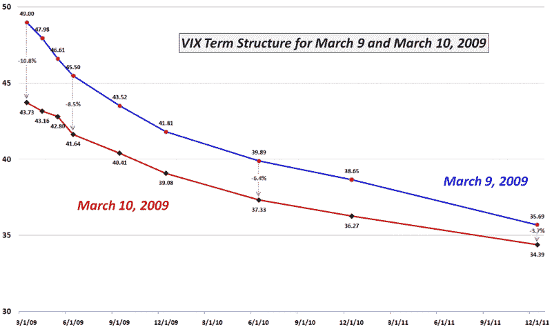

<!--yml
category: 未分类
date: 2024-05-18 17:56:11
-->

# VIX and More: More Volatility + Less Fear = Lower VIX?

> 来源：[http://vixandmore.blogspot.com/2009/03/more-volatility-less-fear-lower-vix.html#0001-01-01](http://vixandmore.blogspot.com/2009/03/more-volatility-less-fear-lower-vix.html#0001-01-01)

Yesterday’s rally resulted in a 6.4% jump in the SPX and pulled the 10 and 20 day historical volatility in the SPX up to levels not seen since December. While very few investors are convinced that last week’s bottom is now safe, there is a growing sense that the markets may have backed far away enough from the precipice for everyone to be able to take a few deep breaths.

So we have more volatility and less [fear](http://vixandmore.blogspot.com/search/label/fear) – and the VIX falling 10.7% on yesterday’s rally.

Of course the VIX is all about forward-looking volatility and is less concerned with [historical volatility](http://vixandmore.blogspot.com/search/label/historical%20volatility), even though there is a high degree of correlation between the two.

In my opinion, the reason why violent upside moves in the SPX tend to result in a lower VIX even in the face of rising volatility is due to several factors. As noted above, one of those factors is a smaller fear component of the VIX when markets are rising. Another important factor that depresses the VIX during a large jump in the SPX is the much smaller number of investors who rush to buy put protection without giving much concern to price. Finally, history demonstrates that for the most part, markets tend to fall more sharply than they rise, so statistical measures of volatility are likely to show greater volatility when the SPX is making a large move down than when it is moving up sharply.

The chart below shows the changes in the VIX [term structure](http://vixandmore.blogspot.com/search/label/term%20structure) from Monday’s close to yesterday’s close. As usual, the biggest drop in the VIX is in the front months with the two front months show volatility dropping about 10%. On the other hand SPX options 15 months out shows volatility dropping 6.4%, a relatively high ratio when compared to the front months. I submit that the distant months are reflecting not just a change in short-term concerns, but a sense that [structural volatility](http://vixandmore.blogspot.com/search/label/structural%20volatility) and systemic risk are much less of an issue at the present time than had previously been believed.

*[source: CBOE, VIX and More]*