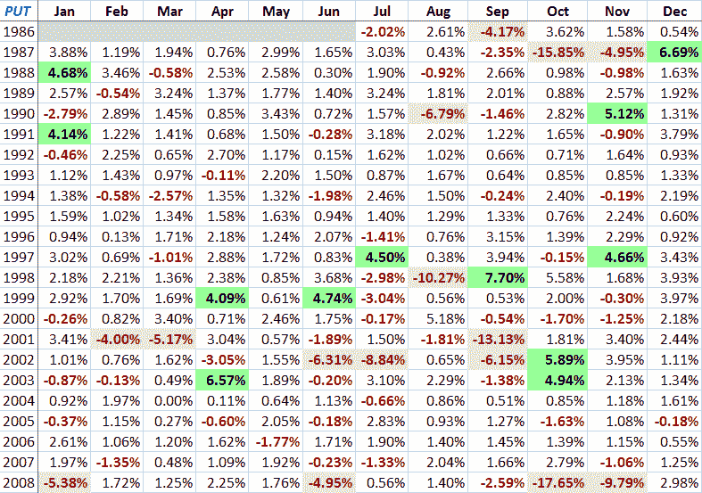

<!--yml
category: 未分类
date: 2024-05-18 18:06:27
-->

# VIX and More: More on PUT Returns

> 来源：[http://vixandmore.blogspot.com/2009/01/more-on-put-returns.html#0001-01-01](http://vixandmore.blogspot.com/2009/01/more-on-put-returns.html#0001-01-01)

Given the surprising interest in [put-write](http://vixandmore.blogspot.com/search/label/put-write) strategies and the CBOE PutWrite Index ([PUT](http://vixandmore.blogspot.com/search/label/PUT)), I have spent some additional time with the PUT data to see what sort of secrets I might be able to uncover.

I must confess that the more I dig, the more I am intrigued by this index put-write approach. Since there has been considerable discussion about the differences in return between the PUT and the closely related CBOE BuyWrite ([BXM](http://vixandmore.blogspot.com/search/label/BXM)) Index, I will start by showing a table that has a year-by-year comparison of the PUT and the BXM. Just for fun I threw in the average VIX for each year, the change in the average VIX from year to year, the VIX range for the year and a ratio of that range divided by the average VIX. While none of these additional data points provides a smoking gun, each offers up a piece of the overall performance puzzle.

The second graphic is a simple matrix of monthly returns for the PUT since 1986\. Not surprisingly, the two worst monthly returns were during the volatility peaks in October [1987](http://vixandmore.blogspot.com/search/label/1987) and October 2008\. In a related note, several of the most profitable months for the PUT came just after high volatility events.

*[Source: CBOE, VIX and More]*

For those looking to dig deeper into this issue, consider that put-write absolute and relative returns are largely a function of implied volatility, the trending characteristics of the SPX and interest rates. Note also that that upper chart only goes back to June 1^(st), 1988 because that is when Standard & Poor’s began reporting daily dividends for the S&P 500 Total Return Index.