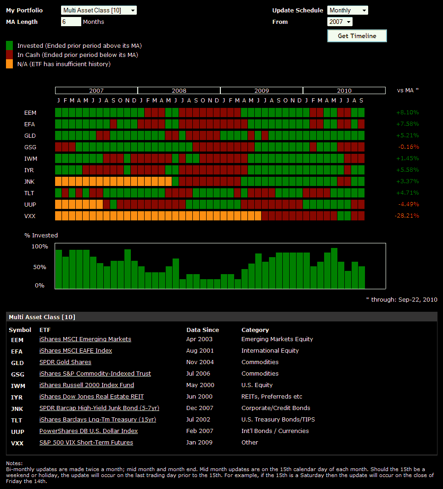

<!--yml
category: 未分类
date: 2024-05-18 17:02:47
-->

# VIX and More: More on the Multi-Asset Class ETF Portfolio

> 来源：[http://vixandmore.blogspot.com/2010/09/more-on-multi-asset-class-etf-portfolio.html#0001-01-01](http://vixandmore.blogspot.com/2010/09/more-on-multi-asset-class-etf-portfolio.html#0001-01-01)

Yesterday’s post, [Diversification, Momentum and Sidestepping the 2008 Panic](http://vixandmore.blogspot.com/2010/09/diversification-momentum-and.html), brought such a positive response that I thought a brief follow-up is in order.

In the chart below, courtesy of [ETFreplay.com](http://etfreplay.com/), I show how the Multi-Asset Class ETF Portfolio I referred to yesterday performed on a month to month basis, this time using the ETFreplay’s [Portfolio Moving Average timeline tool](http://etfreplay.com/members/timeline_portfolioma.aspx). The chart is really a table which shows all of the ETFs and the results of the moving average rule which determined whether to be long or in cash for each month of the period covered. The far right portion of that graphic also shows where the each of the individual ETFs currently stands relative to their selected (in this case it was six months) moving average.  Finally, the column graph toward the bottom also shows what percentage of the total ETF portfolio was long in each month.

As an aside, someone asked for a recommendation on a site for backtesting stocks based on fundamental data. My suggestion was to check out [Portfolio123.com](http://www.portfolio123.com/), which is the site discussed in the bottom of the links below.

Related posts:

*[source: ETFreplay.com]*

***Disclosure(s):*** *none*