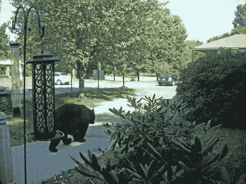

<!--yml
category: 未分类
date: 2024-05-18 18:29:09
-->

# VIX and More: New Contrarian Sentiment Indicator?

> 来源：[http://vixandmore.blogspot.com/2008/08/new-contrarian-sentiment-indicator.html#0001-01-01](http://vixandmore.blogspot.com/2008/08/new-contrarian-sentiment-indicator.html#0001-01-01)

My father lives in suburban Connecticut where the deer are plentiful, but there is little else in the way of large mammals.  Or so I thought.  Apparently a neighbor saw a bear walking up my father’s driveway yesterday.

Out of curiosity, I went to Google to check for bear sightings in the area and was surprised to find a story about [another bear sighting](http://www.courant.com/news/local/fv/hc-simbear0823.artaug23,0,6554915.story) several days ago in a neighboring town, Simsbury, with the accompanying photo snapped from inside an insurance agency by an alert Kris Anderson.  Now I really began to wonder: just how many bears no longer have enough room to wander around in lower Manhattan and have moved to Connecticut to take up residence?  While the exact number is a mystery, I was surprised to see that according to the Connecticut Department of Environmental Protection, there have been [1349 black bear sightings](http://www.depdata.ct.gov/wildlife/sighting/bearsight.asp) in the state over the course of the past year.  Granted, it has been 30 years since I have lived in the state, but that number is about 1330 more than I would have guessed.  Incidentally, Simsbury appears to be the bear capital of Connecticut, with 229 sightings – or about two every three days.

Investors take note: Stamford and Greenwich, where hedge funds are a dime a dozen, have not reported any bear sightings in the past year.