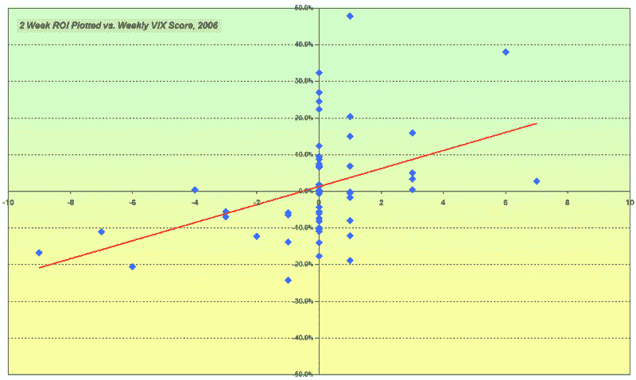

<!--yml
category: 未分类
date: 2024-05-18 15:58:58
-->

# VIX and More: New Feature #1: VIX Weekly Sentiment Indicator

> 来源：[http://vixandmore.blogspot.com/2007/02/new-feature-1-vix-weekly-score.html#0001-01-01](http://vixandmore.blogspot.com/2007/02/new-feature-1-vix-weekly-score.html#0001-01-01)

The time has come to start adding some regular features to this blog, in addition, of course, to the regular barrage of pastel Excel charts…

Today I am introducing the VIX Weekly Sentiment Indicator – or VWSI if you like unwieldy acronyms. The intent of this indicator is to gauge the future movements of the VIX in the coming week or so. In fact, the indicator has proven to be a useful tool for predicting VIX moves in the 1-4 week period. For better or for worse, I will not be trotting out a bunch of statistics to demonstrate how well the VWSI would have performed over various backtesting periods. Instead, consider the following scatter plot showing the two week ROI on various VWSI scores from 2006 as reasonably representative of the predictive power the VWSI:

The factors that have the largest impact on VWSI scores are largely oscillator calculations involving various

[simple moving averages](http://stockcharts.com/school/doku.php?id=chart_school:technical_indicators:moving_averages)

, the

[Commodity Channel Index](http://stockcharts.com/school/doku.php?id=chart_school:technical_indicators:commodity_channel_index_cci)

, the

[Williams %R](http://stockcharts.com/school/doku.php?id=chart_school:technical_indicators:williams_r)

indicator, and others. It is worth noting that the weekly VWSI scores have no memory of the previous week’s scores. Therefore, even while the value of a score may have tradeable implications for a 1-4 week period, a new score is constructed from scratch each week. As a result, extreme VWSI scores rarely persist for more than one or two weeks.

Finally, the VWSI temperature gauge below should be relatively self-explanatory, particularly if you keep in mind that the "bullish" and "bearish" labels apply to the VIX, not to the broader markets, which are usually negatively correlated with the VIX. The reading for the week ending 2/16/07 is +1, which is considered to be in the neutral zone. Last week’s VWSI reading was an even zero.