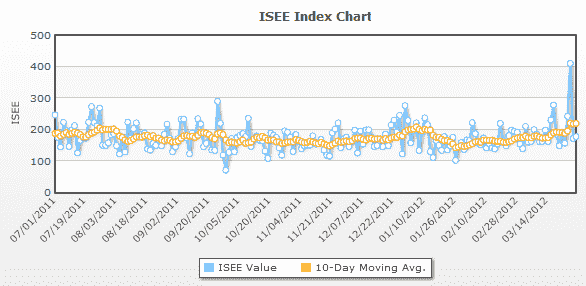

<!--yml
category: 未分类
date: 2024-05-18 16:34:25
-->

# VIX and More: New Single Day High in ISEE Equities Only Index on Monday

> 来源：[http://vixandmore.blogspot.com/2012/03/new-single-day-high-in-isee-equities.html#0001-01-01](http://vixandmore.blogspot.com/2012/03/new-single-day-high-in-isee-equities.html#0001-01-01)

Lost in all the hoopla over the VelocityShares Daily 2x VIX Short-Term ETN ([TVIX](http://vixandmore.blogspot.com/search/label/TVIX)) was a historic event in the options and market [sentiment](http://vixandmore.blogspot.com/search/label/sentiment) world on Monday: a new single day high in the [ISEE](http://vixandmore.blogspot.com/search/label/ISEE) equities only [call to put](http://vixandmore.blogspot.com/search/label/put%20to%20call) ratio.

To recap for those who may not be familiar with the ISEE, this ratio was developed by the International Securities Exchange (ISE) and is calculated by dividing opening long call options bought by ISE customers by opening long put options bought by ISE customers, then multiplied by 100\. The ‘equities only’ slice of the full transaction pie means that all trades with indices and ETPs are excluded from this data, which also reduces the likelihood that any of the ISEE equities only data includes trades intended largely as portfolio hedges.

Monday’s record close of 410 means the ISE customers were buying four times as many calls as puts. Because there tends to be a lot of noise in the daily data, I like to average the data over a 10-day period. The chart below shows the ISEE equities only index since July 2011, along with the 10-day moving average.

Generally, put to call data is considered to be a [contrarian indicator](http://vixandmore.blogspot.com/search/label/contrary%20indicators) that flags when the masses are becoming overly exuberant or fearful and on Monday at least, exuberance – rational or otherwise – was running rampant, perhaps over the excitement of growing evidence of possible QE3 activity and a [Bernanke put](http://vixandmore.blogspot.com/search/label/Bernanke%20put) in general.

For what it is worth, the prior single day high in the ISEE equities only index dates from December 2010, when stocks were in the middle of a six-month bull move that resembles the current move in several respects and carried the SPX from 1039 to 1344.

Related posts:

**

*[source(s): International Securities Exchange]*

***Disclosure(s):*** *short TVIX at time of writing*