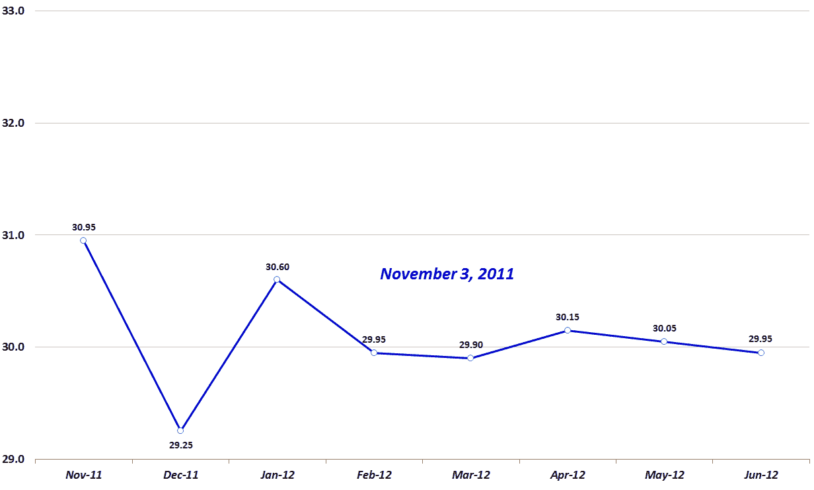

<!--yml
category: 未分类
date: 2024-05-18 16:47:55
-->

# VIX and More: New VIX Backwardation Record

> 来源：[http://vixandmore.blogspot.com/2011/11/new-vix-backwardation-record.html#0001-01-01](http://vixandmore.blogspot.com/2011/11/new-vix-backwardation-record.html#0001-01-01)

This week marks the first time that the front two months of the [VIX futures](http://vixandmore.blogspot.com/search/label/VIX%20futures) [term structure](http://vixandmore.blogspot.com/search/label/term%20structure) have been in [backwardation](http://vixandmore.blogspot.com/search/label/backwardation) each day for more than three consecutive months. In fact, the current streak of 68 days eclipses the old record of 63 days that dates to the 2008 financial crisis.

While the backwardation streak is intact for the front two months, when looking at the full VIX futures term structure, the futures curve has reverted to [contango](http://vixandmore.blogspot.com/search/label/contango) five times over the course of the past three weeks. The primary reason that the front two months have remained in backwardation in defiance of the rest of the VIX futures term structure has to do with something I call the “[holiday effect](http://vixandmore.blogspot.com/search/label/Holiday%20Effect)” or “[calendar reversion](http://vixandmore.blogspot.com/search/label/calendar%20reversion).” Essentially, what happened a little over two weeks ago was that the roll from the October front month to the November front month VIX futures, as well as from the November second month to the December second month VIX futures has added some incremental holiday effect backwardation to the front two months. This is due to the fact that the second month VIX futures have an expiration of December 21^(st), and these are artificially depressed due to the historically low volatility associated with the holiday season. The impact is being felt by all the short-term VIX futures ETPs that are buying second month (December) VIX futures at artificially depressed levels and selling front month (November) VIX futures as part of the daily rebalancing process.

The graphic below shows the 1.70 point differential between the front month and second month VIX futures. Note that it is not until February 2012 that the term structure starts to flatten out, as investors begin to converge on the idea that the VIX is likely to hug the 30 level for the better part of the first half of next year.

Related posts:

**

 *[source: Interactive Brokers]*

***Disclosure(s):*** *short VIX at time of writing*