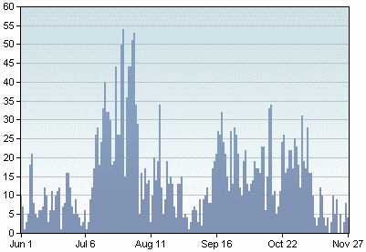

<!--yml
category: 未分类
date: 2024-05-18 18:52:46
-->

# VIX and More: Not a Lot of Fear or Volatility Lately

> 来源：[http://vixandmore.blogspot.com/2007/11/not-lot-of-fear-or-volatility-lately.html#0001-01-01](http://vixandmore.blogspot.com/2007/11/not-lot-of-fear-or-volatility-lately.html#0001-01-01)

Given all the gloom and doom headlines across the mainstream media and blogging world (the lines are already blurring, it seems…) I am a bit surprised to see how little journalistic panic (embellishment?) has translated into market panic.

Starting with the graphic to the left, which depicts the frequency that the term “VIX” has appeared in blog posts with a certain minimum Technorati authority level over the past 180 days ([see original tool](http://charts.technorati.com/chart/VIX?chartdays=180&language=en&authority=a4)), it almost appears as if the VIX is an idea whose time has come and gone.  Lately, the talk is all about subprime, CDOs, SIVs, with [interest rate spreads](http://www.bloomberg.com/markets/rates/index.html) as the scorecard de jour.  The markets may be down 10%, but with the VIX at 26 and change as I type this, the VIX is not part of the story.

In my ongoing effort to attempt to differentiate between fear and volatility, I turn to the [VIX:SDS ratio](http://vixandmore.blogspot.com/search/label/VIX%3ASDS) at moments like these to see how fear has waxed and waned while the markets have fallen rather dramatically.  The one year chart of this ratio is below.  Previous incarnations of the VIX:SDS ratio chart have all been of the 6 month variety, but I think it is important to look at the current market environment and be able to compare it to the February-March and July-August VIX spikes (the SDS inverse ETF only launched on 6/13/06, so it is not possible to capture the ratio during VIX spike from 5/12/06 to 6/13/06.)

There are many ways to think about this chart (keeping in mind, of course, that it compares an oscillating number with a beta of about -4.2 to a trending number with a target beta of -2.0), but what I keep coming back to is the distance between the current reading or 10 day SMA and the longer-term 100 day SMA.  In some respects, this isolates the magnitude of the fear component of the VIX and in the chart below, it underscores how little fear there has been relative to the recent drop in the SPX, especially when compared to similar values in February-March and July-August.  I am not sure exactly how to interpret this, but I suspect that either the market will recover to a level that is commensurate with the fear, or perhaps we will see a significant VIX spike well into the 30s that will likely signal a near-term bottom.  And despite what you read elsewhere, not all market bottoms require a high volume capitulation session, with an accompanying VIX spike.