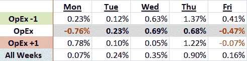

<!--yml
category: 未分类
date: 2024-05-18 17:32:33
-->

# VIX and More: Options Expiration Weeks and the March to August Bull Market

> 来源：[http://vixandmore.blogspot.com/2009/08/options-expiration-weeks-and-march-to.html#0001-01-01](http://vixandmore.blogspot.com/2009/08/options-expiration-weeks-and-march-to.html#0001-01-01)

For a number of reasons, the [options expiration](http://vixandmore.blogspot.com/search/label/options%20expiration) cycle can be extremely difficult to trade. One of the problems with options [expiration week](http://vixandmore.blogspot.com/search/label/expiration%20week) is that the forces acting on stock prices are often much different this week than during other weeks, often ignoring underlying existing trends, but sometimes magnifying them.

A good rule of thumb is that the week before options expiration is most likely to be bullish and the week after options expiration is most likely to be bearish. On average, options expiration week is less volatile and more directionally neutral than these other two weeks.

In the table below, I looked at data since the March 6^(th) low and found it interesting that the week before options expiration has been the most bullish of the three expiration weeks, with the week after options expiration the second most bullish, by a small margin. Options expiration week itself has been relatively flat, particularly when compared to the other two weeks.

My knee-jerk explanation for this is that stock movements during options expiration week are more likely to be random and out of synch with underlying trends. As a result, during options expiration week, stocks frequently underperform in bull markets and outperform in bear markets.

For some related posts, try: