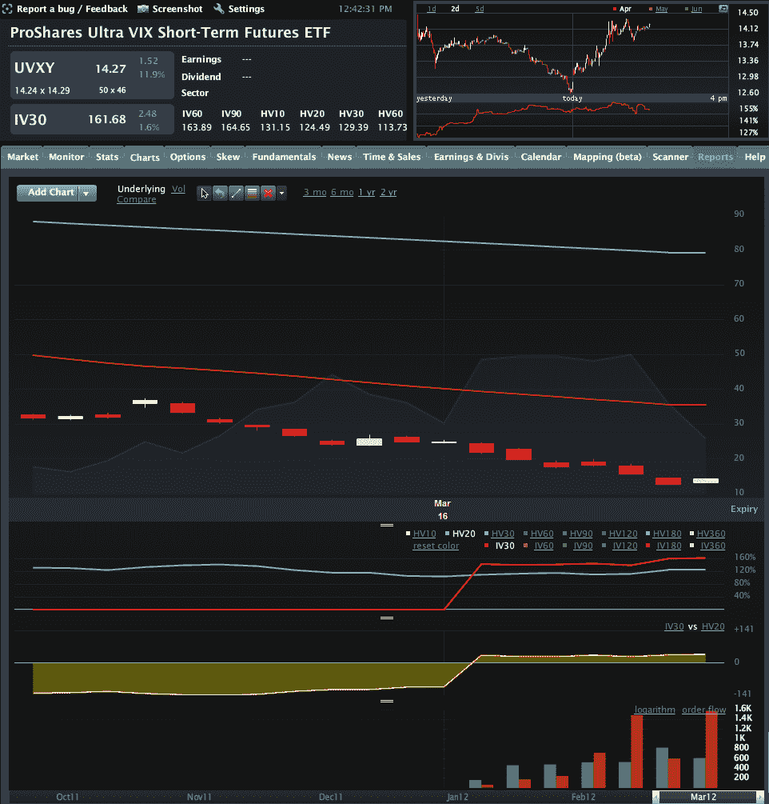

<!--yml
category: 未分类
date: 2024-05-18 16:34:56
-->

# VIX and More: Options on UVXY and SVXY Open Up New VIX ETP Trading Approaches

> 来源：[http://vixandmore.blogspot.com/2012/03/options-on-uvxy-and-svxy-open-up-new.html#0001-01-01](http://vixandmore.blogspot.com/2012/03/options-on-uvxy-and-svxy-open-up-new.html#0001-01-01)

Whether or not I find it useful to flog the wounded horse otherwise known as the VelocityShares Daily 2x VIX Short-Term ETN ([TVIX](http://vixandmore.blogspot.com/search/label/TVIX)), it seems as if investors and the media insist that the wild and crazy story of this +2x [VIX futures](http://vixandmore.blogspot.com/search/label/VIX%20futures) ETN remain on the front page for now.

While the TVIX story is indeed a fascinating one (see links below for more details), I fear it has crowded out a potentially more useful development from last week that has been criminally overlooked, the launch of options on two important [VIX ETFs](http://vixandmore.blogspot.com/search/label/VIX%20ETF):

*   ProShares Ultra VIX Short-Term Futures ETF ([UVXY](http://vixandmore.blogspot.com/search/label/UVXY))

*   ProShares Short VIX Short-Term Futures ETF ([SVXY](http://vixandmore.blogspot.com/search/label/SVXY))

First off, note that the fact that these two products are exchange-traded *funds* instead of exchanged-traded *notes* means that it was much easier for options to be approved. While their more famous ETN counterparts, TVIX and [XIV](http://vixandmore.blogspot.com/search/label/XIV), grab most of the headlines, the addition of options means that traders now have much more flexibility in terms of strategy and tactics with UVXY and SVXY. 

In the past when I have mentioned how options on VIX ETPs were critical to their long-term success, I was met with a few (electronic) blank stares. Part of this reflects that fact that many have been drawn to the VIX ETPs for the potential to reap huge profits in a short period of time (more on this in [The Trader Development Stage Model and the Jump from Stocks to Options](http://vixandmore.blogspot.com/2009/09/trader-stage-development-model-and-jump.html)) with leveraged trades. Talk to most professional options traders, however, and leverage is rarely a factor they mention as a reason for their focus on options trading. In fact, pros are more likely to cite the two key advantages of options as their flexibility and ability to structure defined [risk](http://vixandmore.blogspot.com/search/label/risk) (or limited risk) trades.

This brings me back to options on UVXY and SVXY. With UVXY down 83% for the quarter as of yesterday’s close, one would think that defined risk positions – on the long or short side – would be a critical factor in structuring future trades. With the huge [contango](http://vixandmore.blogspot.com/search/label/contango) and negative [roll yield](http://vixandmore.blogspot.com/search/label/roll%20yield) currently in the VIX futures, a directional bet in either direction entails huge risk. For shorts, this means that a short position can have its risk capped by buying UVXY calls. For longs this means that a long position can also limit risk by buying puts.

There are other ways to implement defined risk trades, notably with [vertical credit spreads](http://vixandmore.blogspot.com/search/label/vertical%20credit%20spread) and [vertical debit spreads](http://vixandmore.blogspot.com/search/label/vertical%20debit%20spread), where gains and losses are limited to the distance between strikes. Traders can also just simply buy puts and calls to put a directional idea to work, knowing that their maximum loss will be limited to the purchase price.

In hard to borrow situations – which are common with some VIX ETPs – traders can also use options to create a [synthetic](http://vixandmore.blogspot.com/search/label/synthetic) position. For instance, a long put plus a short call is the equivalent of a synthetic short, so if no shares are available to borrow, a synthetic position might be an excellent proxy, with the same profit and loss potential as a standard short position, yet typically tying up a lot less trading capital.

Note that the markets for options in UVXY and SVXY are only one week old and not particularly liquid at this stage. On the other hand, volumes are ramping up quickly (see graphic of UVXY options volume, etc. below) and the flexibility and risk control inherent in options products makes these attractive, particularly so when applied to highly volatile products like UVXY and SVXY.

Related posts:

**

*[source(s): LivevolPro.com]*

***Disclosure(s****): long XIV and SVXY,short TVIX and UVXY at time of writing; Livevol is an advertiser on VIX and More*