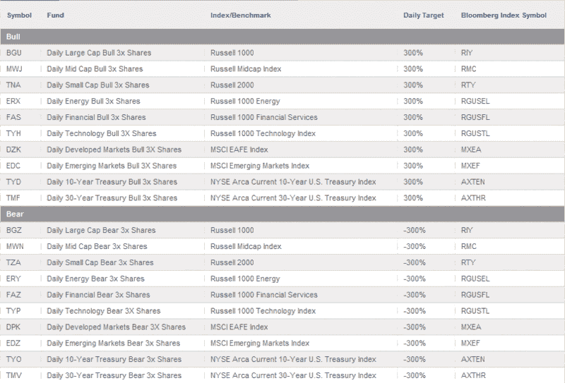

<!--yml
category: 未分类
date: 2024-05-18 17:45:58
-->

# VIX and More: Options on the Direxion Leveraged ETFs

> 来源：[http://vixandmore.blogspot.com/2009/05/options-on-direxion-leveraged-etfs.html#0001-01-01](http://vixandmore.blogspot.com/2009/05/options-on-direxion-leveraged-etfs.html#0001-01-01)

The last time I checked in with the [Direxion](http://vixandmore.blogspot.com/search/label/Direxion) [triple ETFs](http://vixandmore.blogspot.com/search/label/triple%20ETFs) was in early February, when I asked [Why Is There So Little Volume in the Most Recent Direxion ETFs?](http://vixandmore.blogspot.com/2009/02/why-is-there-so-little-volume-in-most.html) While that question did not receive a direct answer, I noted that in subsequent weeks, volume picked up dramatically in the two most volatile new pairs, the emerging markets ([EDC](http://vixandmore.blogspot.com/search/label/EDC) and [EDZ](http://vixandmore.blogspot.com/search/label/EDZ)) and technology ([TYH](http://vixandmore.blogspot.com/search/label/TYH) and [TYP](http://vixandmore.blogspot.com/search/label/TYP)) ETFs.

Toward the end of February, Direxion launched another triple ETF pair, the mid cap bull ([MWJ](http://vixandmore.blogspot.com/search/label/MWJ)) and mid cap bear ([MWN](http://vixandmore.blogspot.com/search/label/MWN)) ETFs. In mid-April, Direxion added some triple ETF bonds to the mix, with a 30-Year U.S. Treasury bull ([TMF](http://vixandmore.blogspot.com/search/label/TMF)) and bear ([TMV](http://vixandmore.blogspot.com/search/label/TMV)) pair, as well as a 10-Year U.S. Treasury bull ([TYD](http://vixandmore.blogspot.com/search/label/TYD)) and bear ([TYO](http://vixandmore.blogspot.com/search/label/TYO)) pair.

For more details on the current Direxion triple ETF lineup, check out the graphic below or visit the [Direxion Shares ETF web site](http://www.direxionshares.com/etfs).

In addition to expanding the universe of available triple ETFs, Direxion has sought to address criticism of the tracking error in these ETFs by adding a “Daily” prefix to each ETF name, in order to emphasize that these ETFs are rebalanced on a daily basis and only attempt to match daily moves, not track the target indices over an extended period of time. Interestingly, anyone who visits the Direxion Shares home page is met first with, “Direxion Shares are not for everyone. Are they for you?” and a [link](http://www.direxionshares.com/education_faq.html#1) that attempts to dissuade what they describe as the conservative investor.

One of the aspects of triple ETFs that I find has some interesting strategic implications is the availability of options. As of this week, there are now options available on all of the Direxion triple ETFs with the exception of the ones based on the EAFE index, [DZK](http://vixandmore.blogspot.com/search/label/DZK) and [DPK](http://vixandmore.blogspot.com/search/label/DPK).

Needless to say, there are very few trading vehicles out there with the potential to move as rapidly as options on triple ETFs, but for experienced options traders, these options offer a great deal of potential reward, paired with commensurate risk, of course.

*[graphic: Direxion Shares]*

***Disclosure****: Long TYP at time of writing.*