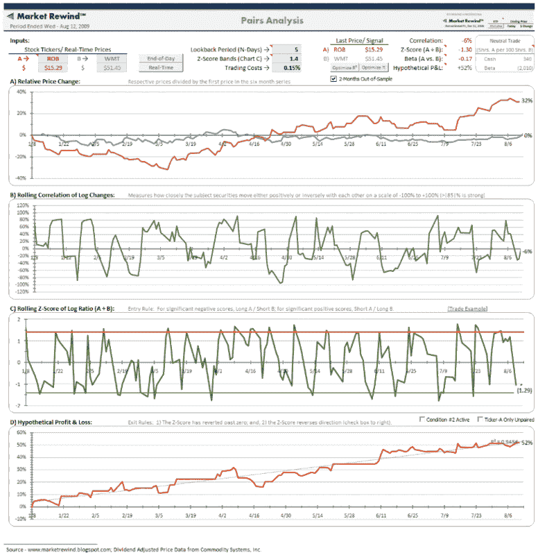

<!--yml
category: 未分类
date: 2024-05-18 17:33:50
-->

# VIX and More: Pairs Trading with ROB

> 来源：[http://vixandmore.blogspot.com/2009/08/pairs-trading-with-rob.html#0001-01-01](http://vixandmore.blogspot.com/2009/08/pairs-trading-with-rob.html#0001-01-01)

While I have never written down any sort of mission statement or goals for *VIX and More*, my aim here has always been to bring fresh ideas, new subject matter and original graphics to an investment landscape that I find all too often overrun by the same warmed over sound bites and clichés.

Ideally, I would like to give readers a steady diet of ideas and concepts they can ruminate about and use to incorporate new thinking into their trading.

I have never been keen on trading blogs, but there are times when I should probably make a better effort to build a bridge from ruminations to trading. Yesterday’s [Hermès vs. Wal-Mart](http://vixandmore.blogspot.com/2009/08/hermes-vs-wal-mart.html) is a case in point. The post generated a fair amount of feedback, including some discussion about possible pairs trading approaches for some retailing ETFs and individual stocks.

The chart below is an adaptation of the Claymore/Robb Report Global Luxury Index ETF ([ROB](http://vixandmore.blogspot.com/search/label/ROB)) to Wal-Mart ([WMT](http://vixandmore.blogspot.com/search/label/WMT)) ratio discussed in yesterday’s post and incorporates some [pairs trading](http://vixandmore.blogspot.com/search/label/pairs%20trading) tools found in [ETF Rewind](http://etfrewind.blogspot.com/), a powerful Excel spreadsheet tool and companion blog that is a sister site to Jeff Pietsch’s popular [Market Rewind](http://marketrewind.blogspot.com/) blog.

The chart shows the potential for a market neutral pairs trading approach using ROB and WMT that incorporates a 4 day lookback period and results in a nice smooth hypothetical profit and loss curve. [[Click to view full-sized original graphic](http://www.etfrewind.com/overview/ROB%20Pairs/ROBWMT.png)]

Readers who are interested in learning more about pairs trading or who are interested in a superb Excel spreadsheet for analyzing ETFs are encouraged to check out in [ETF Rewind](http://etfrewind.blogspot.com/), which is available with a three day free trial.

*[source: ETF Rewind]* 

***Disclosure:*** *I use ETF Rewind on a daily basis and have been so happy with it that I now offer a special annual subscription bundle consisting of VIX and More, ETF Rewind and [Quantifiable Edges](http://quantifiableedges.blogspot.com/) in a ‘*[Blogger Triple Play](http://vixandmoresubscriber.blogspot.com/2009/03/announcing-blogger-triple-play.html)*’*