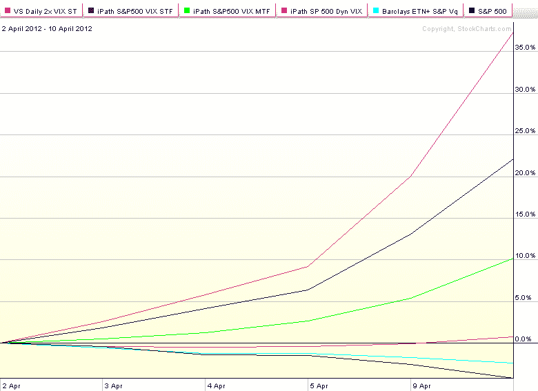
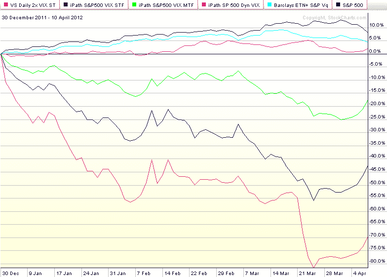

<!--yml
category: 未分类
date: 2024-05-18 16:33:13
-->

# VIX and More: Performance of VIX ETP Hedges in Current Selloff

> 来源：[http://vixandmore.blogspot.com/2012/04/performance-of-vix-etp-hedges-in.html#0001-01-01](http://vixandmore.blogspot.com/2012/04/performance-of-vix-etp-hedges-in.html#0001-01-01)

It was only a week ago that I discussed the performance of 31 VIX and volatility-based exchange-traded products in [VIX ETP Returns for Q1 2012](http://vixandmore.blogspot.com/2012/04/vix-etp-returns-for-q1-2012.html) and barely a month ago that I examined in some detail the workings of two [VIX ETPs](http://vixandmore.blogspot.com/search/label/VIX%20ETN), [VQT](http://vixandmore.blogspot.com/search/label/VQT) and [XVZ](http://vixandmore.blogspot.com/search/label/XVZ), in [Dynamic VIX ETPs as Long-Term Hedges](http://vixandmore.blogspot.com/2012/03/dynamic-vix-etps-at-long-term-hedges.html). When stocks fall and volatility rises, however, which VIX ETP hedges work the best?

The answer is not so simple, unless you know when volatility will begin to spike, how far it will go and how long it will take to get there. Even then, it would still be helpful to know what happens to the [VIX futures](http://vixandmore.blogspot.com/search/label/VIX%20futures) [term structure](http://vixandmore.blogspot.com/search/label/term%20structure) along the way.  Also, there are liquidity constraints that will probably limit the choices for most investors to a half dozen or fewer alternatives.

That being said, the current selloff can be used to highlight some important heuristics and alternative approaches. The first graphic below, for instance, illustrates the performance since the April 2 close of five representative and relatively liquid VIX ETPs ([TVIZ](http://vixandmore.blogspot.com/search/label/TVIZ) was excluded on the grounds of liquidity; its performance during the period was similar to that of [VXX](http://vixandmore.blogspot.com/search/label/VXX)) that can be used as hedges. For the most part, the performance trend is the opposite of what was [observed](http://vixandmore.blogspot.com/2012/04/vix-etp-returns-for-q1-2012.html) during the first quarter.

The three fixed allocation VIX ETPs have been excellent performers during the last five trading days. With +2x leverage and a short-term (weighted average of one month) maturity, [TVIX](http://vixandmore.blogspot.com/search/label/TVIX) (red line) was the standout in the group. The second best performer during the selloff was VXX (blue line), a +1x short-term product.  The +1x mid-term (weighted average of one month) maturity [VXZ](http://vixandmore.blogspot.com/search/label/VXZ) (green line) ETP has also been a strong performer, certainly worthy of a bronze medal. All three hedges have gained more than 10% during the last five trading days, while the S&P 500 index (black line) has fallen 4.3%. In sharp contrast to their fixed allocation brethren, the two dynamic allocation VIX ETPs have both hovered around the unchanged line during the selloff, with [XVZ](http://vixandmore.blogspot.com/search/label/XVZ) (fuchsia line) eking out a small gain after a small bounce today, while [VQT](http://vixandmore.blogspot.com/search/label/VQT) (aqua blue line) has posted a loss during the same period.

Obviously, anyone who bought TVIX (or VXX or VXZ) on April 2 is sitting on a nice profit, but the second graphic, which tracks performance of the same ETPs since the beginning of the year, lays out the big picture conundrum succinctly. In short, the most responsive hedges (TVIX, VXX, etc.) are those which have a fixed allocation and are most susceptible to losses due to [contango](http://vixandmore.blogspot.com/search/label/contango) and negative [roll yield](http://vixandmore.blogspot.com/search/label/roll%20yield) while one is waiting for a hoped-for VIX spike to materialize. The dynamic allocation VIX ETPs, on the other hand, are tweaked to minimize losses due to contango and negative roll yield and thus can be left in place for extended periods, but there is enough lag time built into their dynamic allocation rules so that they offer little protection from sudden and short-lived VIX spikes, while doing a better job of protecting portfolios during extended periods of volatility, such as the peak of European sovereign debt crisis during August-September 2011.

So…if you know when the fireworks are going to start, TVIX and VXX are excellent choices as volatility hedges for long equity portfolios. If the timetable is uncertain (which is often the case) and the goal is to protect against a period of extended high volatility, then VXZ and VQT are likely to be more compelling alternatives.

Related posts:

**

**

*[source(s): StockCharts.com]*

***Disclosure(s):*** *long XVZ; short VIX, VXX and TVIX at time of writing*