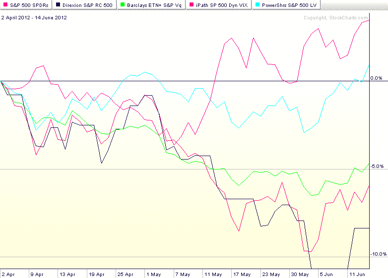

<!--yml
category: 未分类
date: 2024-05-18 16:27:58
-->

# VIX and More: Performance of Volatility-Hedged ETPs

> 来源：[http://vixandmore.blogspot.com/2012/06/performance-of-volatility-hedged-etps.html#0001-01-01](http://vixandmore.blogspot.com/2012/06/performance-of-volatility-hedged-etps.html#0001-01-01)

An emerging area of interest in the markets in general and in this space in particular is the subject of how to blend volatility exposure – both long and short – into a portfolio.

Based upon feedback I have received, three recent articles that have touched upon this subject from different angles have all resonated with readers:

Clearly the role of volatility in a portfolio is a subject that warrants further analysis and discussion.

It is worth noting that issuers of exchange-traded products have taken several approaches to addressing volatility. The most obvious was the launch of [VIX-based ETPs](http://vixandmore.blogspot.com/search/label/VIX%20ETN), such as the popular [VXX](http://vixandmore.blogspot.com/search/label/VXX) (iPath S&P 500 VIX Short-Term Futures ETN,) which is a long basket of short-term [VIX futures](http://vixandmore.blogspot.com/search/label/VIX%20futures).

Subsequent products have tackled the subject of volatility in a variety of different ways, including:

1.  Utilize low beta stocks to minimize portfolio volatility ([SPLV](http://vixandmore.blogspot.com/search/label/SPLV))
2.  Employ a market timing mechanism that dynamically allocates between stocks and bonds according to measures of market volatility ([VSPY](http://vixandmore.blogspot.com/search/label/VSPY))
3.  Employ a market timing mechanism that dynamically allocates between stocks and VIX futures according to measures of market volatility ([VQT](http://vixandmore.blogspot.com/search/label/VQT))
4.  Employ a market timing mechanism that dynamically allocates between long and short volatility positions ([XVZ](http://vixandmore.blogspot.com/search/label/XVZ))

With the S&P 500 index down about 6.3% through yesterday’s close from its April 2^(nd) high, it is reasonable to ask how these approaches have been performing during this bearish phase. The chart below shows the performance of SPY in red. Two of the approaches employed have had a performance trajectory that is almost indistinguishable from that of SPY: VQT (green line); and VSPY (dark blue line), which is thinly traded.

The two standouts during the past 2 ½ months are SPLV (light blue line) and XVZ (purple line). You can see from the graphic that SPLV has done exactly was it is supposed to do: minimize volatility. For the better part of the period in question, SPLV has been largely unchanged. Lately it has risen largely due to its substantial exposure to utilities and consumer staples. The other standout is XVZ, which essentially uses the slope of VIX futures [term structure](http://vixandmore.blogspot.com/search/label/term%20structure) to determine how it allocates between long and short volatility positions. With the VIX futures in [contango](http://vixandmore.blogspot.com/search/label/contango) (front months less expensive than more distant months) since last November, this product has been able to capitalize on negative [roll yield](http://vixandmore.blogspot.com/search/label/roll%20yield), while also providing protection against a spike in the VIX.

While this data should be of interest to traders who are looking for volatility-based [hedges](http://vixandmore.blogspot.com/search/label/hedging) or even speculative applications going forward, today is definitely a case where past performance should not serve as a guideline for what to expect in the next week or two.

For those who are looking for more powerful VIX hedges, long positions in VIX calls and VXX calls (including the weeklys) will provide the most robust long volatility hedges. For those who are looking to minimize portfolio volatility going forward, the four approaches outlined above (as well as the links below) should warrant further investigation.

Related posts:

**

*[source(s): StockCharts.com]*

***Disclosure(s):*** *long XVZ andshort VXX at time of writing*