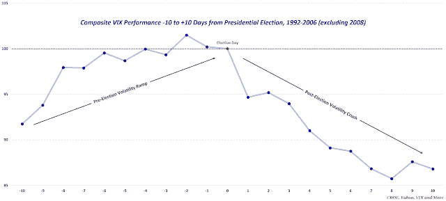

<!--yml
category: 未分类
date: 2024-05-18 16:06:34
-->

# VIX and More: Performance of the VIX in the Two Weeks Before and After Presidential Elections

> 来源：[http://vixandmore.blogspot.com/2020/10/performance-of-vix-in-two-weeks-before.html#0001-01-01](http://vixandmore.blogspot.com/2020/10/performance-of-vix-in-two-weeks-before.html#0001-01-01)

A convergence of concerns related to stimulus, elections, [COVID-19](http://vixandmore.blogspot.com/search/label/COVID-19) and earnings (courtesy of a big [SAP](http://vixandmore.blogspot.com/search/label/SAP) earnings miss) caused the VIX to jump 17.8% today.  How much of that was related to the election?  Well…the 9-day [VIX9D](http://vixandmore.blogspot.com/search/label/VIX9D) spiked 47.8% today, now that the election is within the 9-day measurement window for the first time.  The bottom line is that election uncertainty and anticipated volatility is currently a huge factor in the mindset of the investor.

This raises the question of how jumpy the VIX tends to be in advance of elections and what happens after the election.  If you know anything about what happens to the VIX around [FOMC announcement days](http://vixandmore.blogspot.com/search/label/Fed%20Days), you will find considerable similarities when it comes to elections.  Specifically, the VIX responds to the upcoming [event risk](http://vixandmore.blogspot.com/search/label/event%20volatility) by increasing steadily into the event, dropping sharply on the day of the event and declining even more as the event recedes in the rear-view mirror.

Of course, most think this election is different.  While that is certainly true, all elections are unique in their own way and yet the same general principles apply.

Note that in the graphic below I normalized all the VIX readings from 1992-2016, with the exception of 2008, which just happened to fall at the height of the Great Recession, so the 2008 data is excluded, as it would otherwise skew the results.

|  |
| *[source(s):  CBOE, Yahoo, VIX and More]* |

 *Further Reading:* [The VIX and the Pre-FOMC + Post-FOMC Trades](http://vixandmore.blogspot.com/2013/06/the-vix-and-pre-fomc-post-fomc-trades.html)
[VIX Trends Around FOMC Announcement Days](http://vixandmore.blogspot.com/2008/12/vix-trends-around-fomc-announcement.html)
[VIX Price Movement Around FOMC Meetings](http://vixandmore.blogspot.com/2007/01/vix-price-movement-around-fomc-meetings.html)
[Post-Election Risk Trending Up in Treasuries and the Euro, Down in U.S. Stocks](http://vixandmore.blogspot.com/2016/11/post-election-risk-trending-up-in.html)
[VIX Sets New Record with Nine Up Days in a Row](http://vixandmore.blogspot.com/2016/11/vix-sets-new-record-with-nine-up-days_37.html)
[Top VIX Crushes in History](http://vixandmore.blogspot.com/2016/11/top-vix-crushes-in-history_8.html)
[How to Trade Options Around Volatile Events](https://www.barrons.com/articles/SB50001424053111904184504577518802209654274) *(Barron’s)* [A Conceptual Framework for Volatility Events](http://vixandmore.blogspot.com/2008/10/conceptual-framework-for-volatility.html)
[Volatility During Crises](http://vixandmore.blogspot.com/2012/12/volatility-during-crises.html)
[Fear Poll: Fiscal Cliff Fears Spike, Concerns About Excessive Central Bank Intervention Rise](http://vixandmore.blogspot.com/2012/11/fear-poll-fiscal-cliff-fears-spike.html)
[Fiscal Cliff Worries Grow As Election Nears](http://vixandmore.blogspot.com/2012/11/fiscal-cliff-worries-grow-as-election.html)
[The Hollande Discount](http://vixandmore.blogspot.com/2012/05/hollande-discount.html)
[Chart of the Week: Intrade and the Midterm Elections](http://vixandmore.blogspot.com/2010/10/chart-of-week-intrade-and-midterm.html)
[Chart of the Week: Intrade and Control of the House of Representatives](http://vixandmore.blogspot.com/2010/07/chart-of-week-intrade-and-control-of.html)

For those who may be interested, you can always follow me on Twitter at [@VIXandMore](https://twitter.com/VIXandMore)

***Disclosure(s):*** *none*