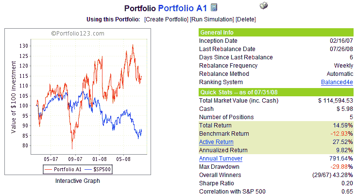

<!--yml
category: 未分类
date: 2024-05-18 18:30:57
-->

# VIX and More: Portfolio A1 Performance Update: 7/31/08

> 来源：[http://vixandmore.blogspot.com/2008/08/portfolio-a1-performance-update-73108.html#0001-01-01](http://vixandmore.blogspot.com/2008/08/portfolio-a1-performance-update-73108.html#0001-01-01)

As previously promised, I am now providing a monthly performance update for Portfolio A1, which I launched live on the blog almost 1 ½ years ago.

The chart below shows the equity curve and some summary performance statistics for Portfolio A1 since the equities only (no ETFs or options), long only portfolio was created on February 16, 2007.  During the 17 ½ months since inception, Portfolio A1 has posted a cumulative return (exclusive of dividends) of 14.6%, while the benchmark S&P 500 index has declined 12.9%.  This adds up to a net performance of +27.5% for the portfolio vs. the benchmark.

As of July 31, Portfolio A1’s holdings included: Terra Industries ([TRA](http://finance.google.com/finance?q=tra)); W&T Offshore ([WTI](http://finance.google.com/finance?q=wti)); DreamWorks Animation ([DWA](http://finance.google.com/finance?q=dwa)); Synaptics ([SYNA](http://finance.google.com/finance?q=syna)); and Hugoton Royalty Trust ([HGT](http://finance.google.com/finance?q=hgt)). For the record, Portfolio A1 also shares some common ancestry and has a stock ranking system that is similar to the VIX and More Focus Aggressive Trader model portfolio – one of the four model portfolios that I update transaction by transaction for the VIX and More [subscriber newsletter](http://vixandmore.blogspot.com/search/label/subscriber%20newsletter).

As a reminder, Portfolio A1 was created with tools developed by

[Portfolio123.com](http://www.portfolio123.com/)

and is managed via Portfolio123.com’s tool set. For more information on Portfolio123.com, please refer to an earlier post on the subject,

[Portfolio123.com: The Engine Behind Portfolio A1](http://vixandmore.blogspot.com/2007/10/portfolio123com-engine-behind-portfolio.html)

.

  