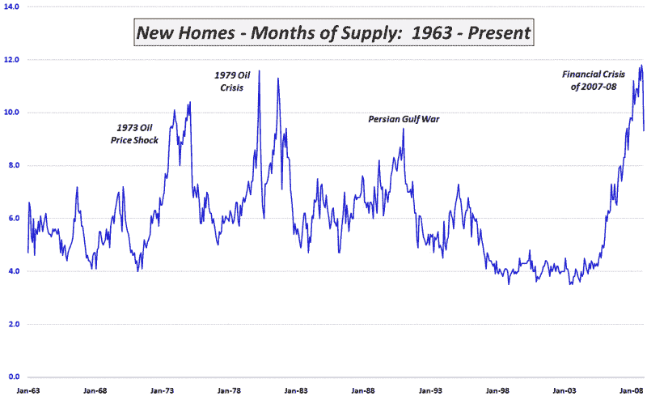

<!--yml
category: 未分类
date: 2024-05-18 18:03:20
-->

# VIX and More: Positive News in Housing Inventories

> 来源：[http://vixandmore.blogspot.com/2009/01/positive-news-in-housing-inventories.html#0001-01-01](http://vixandmore.blogspot.com/2009/01/positive-news-in-housing-inventories.html#0001-01-01)

I have been maintaining for a long time (particularly in the [subscriber newsletter](http://vixandmoresubscriber.blogspot.com/)), that the key to the bottoming process in the economy is [housing](http://vixandmore.blogspot.com/search/label/housing) and the key to housing prices is inventory.

While housing prices continue to fall, yesterday was the first glimpse of hope on the inventory front in a long time. In the graphic below, I have captured the months of supply of housing inventory since 1963\. Note that the December data show the biggest drop in housing inventories in 28 years.

Before anyone gets too excited about this development, however, a couple of caveats are in order. Considering that months of supply is a function of total inventory and the transaction rate, there are several moving parts in these calculations. The fact that housing inventory is still at levels comparable to what was seen in early 2004 means that in absolute terms, there is still a room for considerable improvement before the inventory issue is addressed. Further, in some parts of the country the majority of the transactions are related to foreclosure activity. Given the high elasticity of foreclosure sales, this component of the transaction rate has to be taken with a very large grain of salt.

The economy has likely not yet reached a bottom, but there are encouraging signs. If housing inventory continues to fall and [cash starts departing money market funds](http://vixandmore.blogspot.com/2009/01/chart-of-week-change-of-trend-in-cash.html) in search of better returns, then it is possible to at least entertain the possibility that equities have turned the corner.

*[source: Census Bureau, VIX and More]*