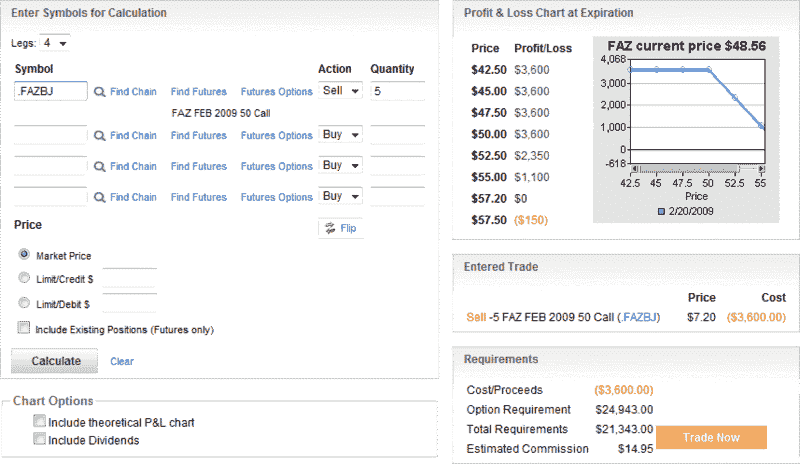

<!--yml
category: 未分类
date: 2024-05-18 18:00:44
-->

# VIX and More: Post-Geithner Financial Naked Calls

> 来源：[http://vixandmore.blogspot.com/2009/02/post-geithner-financial-naked-calls.html#0001-01-01](http://vixandmore.blogspot.com/2009/02/post-geithner-financial-naked-calls.html#0001-01-01)

For the extremely aggressive (and well-capitalized) investor who believes volatility in financials is on the high side and may also have some bullish directional bias, something like a [bear call spread](http://vixandmore.blogspot.com/search/label/bear%20call%20spread) with [FAZ](http://vixandmore.blogspot.com/search/label/FAZ), the -3x financial ETF, might be an interesting trade to look at.

The truly fearless might even look at selling an out of the money FAZ naked call. As I write this, FAZ is trading with a 48 handle and a Feb 50 call sale will bring 7.20, which means there is room for almost 20% upside movement in the ETF before the trade turns unprofitable. Of course, with the likes of triple ETFs FAZ and [FAS](http://vixandmore.blogspot.com/search/label/FAS), 20% moves can happen in a matter of hours…

 **[source: optionsXpress]**