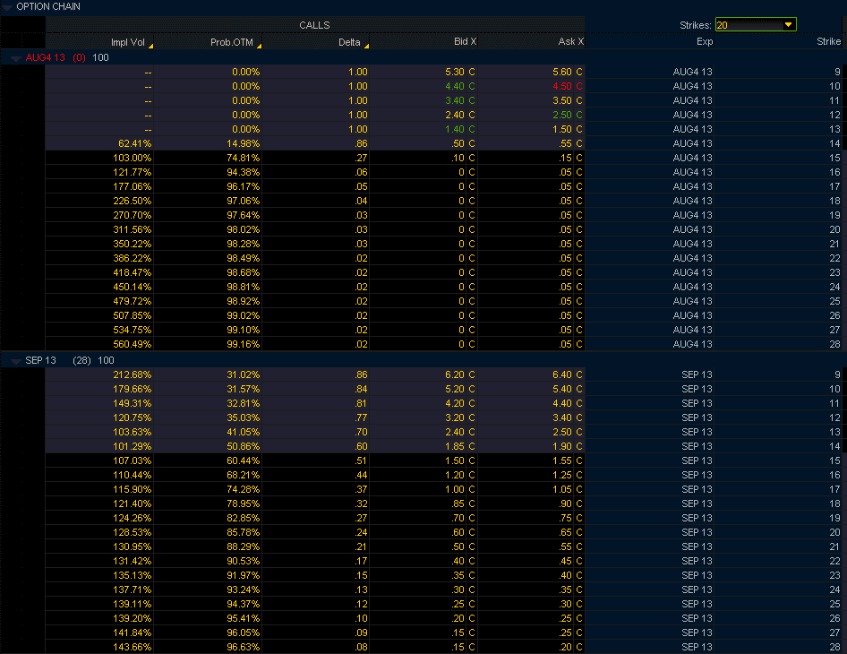

<!--yml
category: 未分类
date: 2024-05-18 16:13:49
-->

# VIX and More: Pricing of VIX August and September Calls

> 来源：[http://vixandmore.blogspot.com/2013/08/pricing-of-vix-august-and-september.html#0001-01-01](http://vixandmore.blogspot.com/2013/08/pricing-of-vix-august-and-september.html#0001-01-01)

The monthly [VIX futures](http://vixandmore.blogspot.com/search/label/VIX%20futures) and [options](http://vixandmore.blogspot.com/search/label/VIX%20options) expiration is a fascinating time from an options strategy perspective, as it marks the point in time in which VIX futures prices collide with the cash/spot VIX. Thanks to the [VIX Special Opening Quotation](http://vixandmore.blogspot.com/search/label/VIX%20SOQ) (SOQ), that price collision is an inexact one, but for all practical purposes, the VIX front month futures and cash/spot index converge once every month, just after the open on a Wednesday thirty days before the standard monthly option in the S&P 500 Index options the following month.

To make things more interesting, the last day of trading for the front month VIX futures and options is the Tuesday session just prior to expiration.

All these product attributes make it difficult to navigate the complex waters of the VIX product platform just prior to expiration, but because the VIX is capable of such sudden sharp moves [see [VIX All-Time Spike #11 (and a treasure trove of VIX spike data)](http://vixandmore.blogspot.com/2013/02/all-time-vix-spike-11-and-treasure.html) for some details,] options prices have to include the possibility of a sudden [VIX spike](http://vixandmore.blogspot.com/search/label/VIX%20spikes) right up until the moment of expiration.

For these reasons, it is sometimes possible to sell VIX options for a surprisingly high premium right before expiration. In the graphic below, I have captured some data from the TD Ameritrade/thinkorswim platform that shows the prices of various VIX calls as of about 2:00 p.m. ET that expire tomorrow, with just more than two hours of trading left in these products. For comparison purposes, I have also included the September options for the same strikes, which will expire on September 18^(th).  For the record, at the time of this snapshot, the VIX was at 14.48 and the August VX futures (now available on the TD Ameritrade/thinkorswim platform as ticker /VXQ3) were at 14.43.

Note that the TD Ameritrade/thinkorswim platform includes information on the implied volatility calculated for these VIX calls as well as the estimated probability that these will expire out-of-the-money on September 18^(th). Theoretically at least, the VIX August 25 calls have a more than 1% of expiring in-the-money at tomorrow’s open, while there is more than a 5% chance that the VIX September 25 calls will expire in-the-money. With an implied volatility of 139%, the VIX September 25 calls are currently bid-ask at 0.25 – 0.30.

I am not recommending selling VIX calls just prior to expiration and I certainly would want anyone who is interested in these type of trades to start out with defined risk trades (e.g., [bear call spreads](http://vixandmore.blogspot.com/search/label/bear%20call%20spread)) before considering trades with unlimited risk...but the possible trading opportunities are fascinating, to me at least.

*[source(s): TD Ameritrade/thinkorswim]*

For those interested in additional background on the VIX expiration and some potential trade ideas, the posts below should provide a good jumping off point.

Related posts:

***Disclosure(s):*** *neutral position in VIX via options at time of writing*