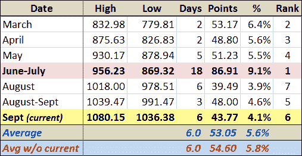

<!--yml
category: 未分类
date: 2024-05-18 17:27:59
-->

# VIX and More: Pullbacks in the 2009 Bull Market

> 来源：[http://vixandmore.blogspot.com/2009/10/pullbacks-in-2009-bull-market.html#0001-01-01](http://vixandmore.blogspot.com/2009/10/pullbacks-in-2009-bull-market.html#0001-01-01)

Nearing the halfway point in today’s trading session, the S&P 500 index has made an intraday low of 1036.38, which is below the recent September 25^(th) low of 1041.17 and about 4.1% below the September 23^(rd) high of 1080.15.

This 4.1% pullback is the seventh significant pullback since the current bull market began back in March. The table below summarizes all the pullbacks of 3.9% or more from the intraday highs to the intraday lows. The current pullback, highlighted in yellow, represents the second longest in terms of duration from the high to the low. As far as the magnitude of the pullback, however, 4.1% ranks sixth out of seven. The average (mean) pullback prior to the current one has been 5.84%. Applying an average pullback to the 1080.15 high would imply a pullback to about SPX 1017.

Some other technical factors have me looking for support in the 1020-1025 area. Should that support fail to materialize, I would not be surprised to see SPX 1017 taken out quickly and the SPX test 1000 in short order.

All things being equal, however, there is no reason to assume that the recent history of short and relatively shallow pullbacks should not continue into the future, with SPX 1100 a more likely next stop than SPX 1000.

