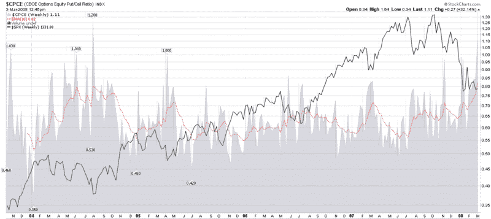

<!--yml
category: 未分类
date: 2024-05-18 18:41:50
-->

# VIX and More: Put to Call Data at Extreme Levels

> 来源：[http://vixandmore.blogspot.com/2008/03/put-to-call-data-at-extreme-levels.html#0001-01-01](http://vixandmore.blogspot.com/2008/03/put-to-call-data-at-extreme-levels.html#0001-01-01)

[Earlier this morning](http://vixandmore.blogspot.com/2008/03/put-to-calls-and-trin-more-skittish.html), I mentioned that the [ISEE](http://vixandmore.blogspot.com/search/label/ISEE) is setting new records on a daily for the all-time lowest readings in the 20, 50 and 100 simple moving averages and pointed out that the CBOE Equity Put to Call numbers have spiked to record levels as well.  I thought a graphic might do a better job of telling the story, so I have attached a weekly chart of the CBOE Equity Put to Call Ratio below.

The chart goes back to the point at which the CBOE started publishing equity only put to call data and uses a 10 week EMA as a smoothing function.  As the chart shows, the current EMA of 82 is a new record, eclipsing the old record of August 2004.  In retrospect, 2004 was a great buying opportunity for those who had the fortitude to go against the crowd.  As for the present, while the jury is still out, the odds are that the current situation is also a good buying opportunity, as difficult as it may be for some to pull the trigger.

[source: StockCharts]