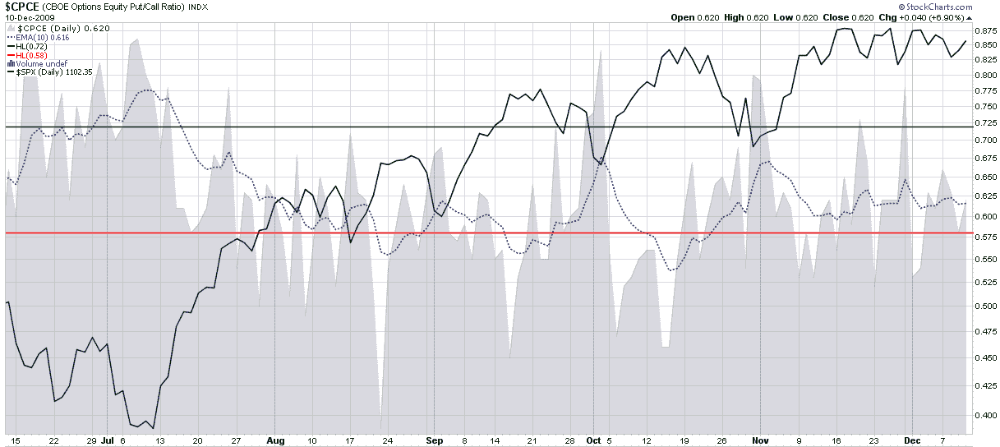

<!--yml
category: 未分类
date: 2024-05-18 17:20:23
-->

# VIX and More: Put to Call Ratio and the Probability of a Downturn

> 来源：[http://vixandmore.blogspot.com/2009/12/put-to-call-ratio-and-probability-of.html#0001-01-01](http://vixandmore.blogspot.com/2009/12/put-to-call-ratio-and-probability-of.html#0001-01-01)

In the last day or two I have been fielded several questions about [put to call](http://vixandmore.blogspot.com/search/label/put%20to%20call) ratios. It seems as if some investors are concerned that there is a stealth movement by sophisticated investors who are making substantial bets on a downward move with large purchases of puts. Invariably, these concerns have led to questions about what I see in the put to call ratios that will confirm or deny this.

To quickly recap, the CBOE publishes three put to call ratios. In my preferred charting site, [StockCharts.com](http://stockcharts.com/), these are known as:

*   $[CPCE](http://vixandmore.blogspot.com/search/label/CPCE) – the ticker for the equity put to call ratio
*   $[CPCI](http://vixandmore.blogspot.com/search/label/CPCI) – the ticker for the index put to call ticker
*   $[CPC](http://vixandmore.blogspot.com/search/label/CPC) – the ticker for the total equity + index data

For reasons I have discussed in the past, I prefer the CPCE ratio and use this as a contrarian signal. The problem with the CPCI data is that institutional order flow for index options tends to come in large chunks that can create misleading short-term signals.

Recently, however, the CPCE, CPCI and CPC have all had very similar looking charts. I have reproduced the six month chart of CPCE below and it shows no unusual spikes in put activity relative to call activity. If anything, the 10 day EMA that I use to smooth the sometimes noisy CPCE data shows an almost eerie flat line for the past month or so, just as was the case when I last wrote about put to call ratios when in [Equity Put to Call Ratio Not Pointing to a Correction](http://vixandmore.blogspot.com/2009/12/equity-put-to-call-ratio-not-pointing.html) when the [Dubai](http://vixandmore.blogspot.com/search/label/Dubai) debt crisis hit.

For more on related subjects, readers are encouraged to check out:

 **[source: StockCharts]*

 ****Disclosure:*** *none***