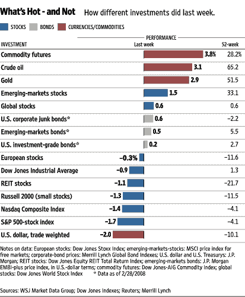

<!--yml
category: 未分类
date: 2024-05-18 18:42:05
-->

# VIX and More: Put to Calls and TRIN More Skittish than VIX, VWSI

> 来源：[http://vixandmore.blogspot.com/2008/03/put-to-calls-and-trin-more-skittish.html#0001-01-01](http://vixandmore.blogspot.com/2008/03/put-to-calls-and-trin-more-skittish.html#0001-01-01)

A quick programming note: henceforth, I am going to be a little more freeform with my end of week commentary, making it less VIX and VWSI-centric. Lately the VIX has been at best a sub-plot in the market turmoil and the VWSI has not generated any extreme readings, so I will be expanding my weekly scope to include some of my other favorite indicators: put to call ratios, market breadth data, TRIN numbers, etc. going forward – or whatever else looks to be most newsworthy.

The Wall Street Journal “What’s Hot and Not” graphic shows where the action was last week – and this story is starting to look familiar. Oil, gold and other commodities were the biggest gainers last week, with a weak dollar and a weak

<country-region st="on"><place st="on">US</place></country-region>

stock market accounting for the biggest losers.

The VIX ended the week up 2.48 (+10.3%) to 26.54, with the

[VWSI](http://vixandmore.blogspot.com/search/label/VWSI)

slipping back to zero. More interesting was the action in the put to call data, where the

[ISEE](http://vixandmore.blogspot.com/search/label/ISEE)

set all-time records lows for the 20, 50 and 100 day moving averages each day from Tuesday through Friday and the

[CPCE](http://vixandmore.blogspot.com/search/label/CPCE)

(CBOE Equity Put to Call Ratio) hit a new high of 1.50\. In the wake of Friday’s precipitous drop, the

[TRIN](http://vixandmore.blogspot.com/search/label/TRIN)

and

[NASDAQ TRIN](http://vixandmore.blogspot.com/search/label/TRINQ)

also ended the week with extreme readings of 2.46 and 2.76, respectively.

All this continues to mean one of two things: either the market is extremely oversold and anxious investors are going to create a massive wall of worry for a nice rebound…or we are in the midst of a financial meltdown not seen in the lifetime of most investors. I continue to reside in the former camp, but am watching SPX 1310 and NDX 1725 for signs of additional cracks in the dike.