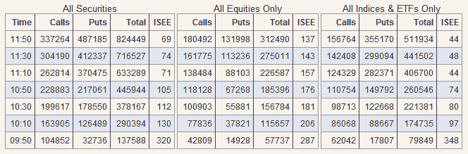

<!--yml
category: 未分类
date: 2024-05-18 18:25:42
-->

# VIX and More: Puts Instead of Shorts?

> 来源：[http://vixandmore.blogspot.com/2008/09/puts-instead-of-shorts.html#0001-01-01](http://vixandmore.blogspot.com/2008/09/puts-instead-of-shorts.html#0001-01-01)

The table below shows call and put activity at the [International Securities Exchange](http://www.ise.com/) ([ISE](http://vixandmore.blogspot.com/search/label/ISE)) during the first two hours of today’s trading. Keep in mind that the ISEE is a “call to put” ratio, not the “[put to call](http://vixandmore.blogspot.com/search/label/put%20to%20call)” ratio reported by the CBOE.

As reflected in the table, right out of the gate there was a flood of calls for indices, ETFs, and individual stocks. Note that in the last hour or so, the activity has tilted heavily toward the put end of the spectrum, as the call to put ratios have dropped dramatically. It is difficult to differentiate between hedging and speculation in these transactions, but now that options spreads seem to be tightening and implied volatility is dropping sharply, I suspect those looking to get [short](http://vixandmore.blogspot.com/search/label/short%20selling) financials and any other part of the market may be leaning toward puts.

It will be interesting to see how the options market is affected by the new shorting regulations.

[source: International Securities Exchange]