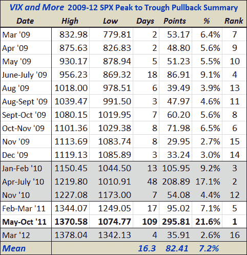

<!--yml
category: 未分类
date: 2024-05-18 16:36:48
-->

# VIX and More: Putting the Current 2.6% SPX Pullback in Recent Historical Context

> 来源：[http://vixandmore.blogspot.com/2012/03/putting-current-26-spx-pullback-in.html#0001-01-01](http://vixandmore.blogspot.com/2012/03/putting-current-26-spx-pullback-in.html#0001-01-01)

Since the beginning of the current bull market – which bottomed at 666.79 exactly three years ago today – I have periodically been posting a table of the most significant pullbacks in the S&P 500 index since that March 2009 bottom. For the record, the current 2.6% decline over four days is barely enough to get it to qualify as one of those 16 pullbacks.

The data below incorporates intraday readings and use pullbacks from high water marks to the eventual trough as the basis for calculating the magnitude and duration of the pullbacks.

While not captured in the table, investors should probably keep in mind that the median pullback during the last three years has lasted 7 trading days and dropped the SPX a total of 5.6%. Were we to see a median pullback form this time around, it would suggest a bottom of about SPX 1301 sometime on Friday after the employment report.

Those looking for bigger numbers might be interested to know that a mean pullback would put the SPX back to the 1275-1279 range, while a ‘pullback’ that would be comparable to the May-October decline from 2011 would set the SPX back all the way to about 1080.

 *******

***Disclosure(s):*** *none**