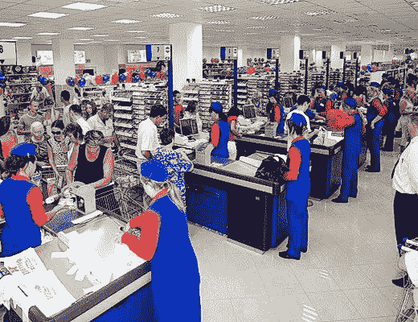

<!--yml
category: 未分类
date: 2024-05-18 18:30:04
-->

# VIX and More: Queuing Theory and the Price of Oil

> 来源：[http://vixandmore.blogspot.com/2008/08/queuing-theory-and-price-of-oil.html#0001-01-01](http://vixandmore.blogspot.com/2008/08/queuing-theory-and-price-of-oil.html#0001-01-01)

I thought I might write something provocative and different this morning, yet I was surprised – and pleased – to see that Kurt Cobb of [Resource Insights](http://resourceinsights.blogspot.com/) beat me to the punch by several days.  In Sunday’s [Does Queuing Theory Explain Oil’s Wild Price Swings?](http://resourceinsights.blogspot.com/2008/08/does-queueing-theory-explain-oils-wild.html) Cobb draws upon queuing theory as a possible explanation for price swings that seem to be out of proportion to changes in supply and demand.

Up front I should say that the extent of my knowledge about [queuing theory](http://en.wikipedia.org/wiki/Queueing_theory) is limited to some brief exposure to the subject back in business school.  Still, that exposure made a significant impression on me, as one of the important takeaways was that a very small and seemingly insignificant change can quickly move a system from equilibrium to chaos.

Consider a grocery store that has ten checkers and only one or two people in each line.  If one checker takes a 10 minute break, you would not expect that lines in the other nine lines would triple or quadruple in just a few minutes, but according to queuing theory, this scenario is quite likely.  Similarly, if customers are entering the store at a rate of one every 15 seconds, it doesn’t sound like a change in the rate to one customer every 14 seconds could impact lines to the degree that they go from two deep to ten deep before the 10 minute break is over, but once again, this is a plausible scenario.

The mathematics of queuing theory (which I have no desire to delve into) explain how very small changes at the margin (i.e., number of checkers, average checkout time, customer arrival rate, etc.) can quickly move a system from equilibrium to bottleneck, with resulting wait times increasing exponentially.  It may be a little bit of a stretch to say that a grocery store is analogous to the world oil market, but I do think queuing theory provides a model for how small changes in input and output rates can create a massive bottleneck problem in a very short period of time.