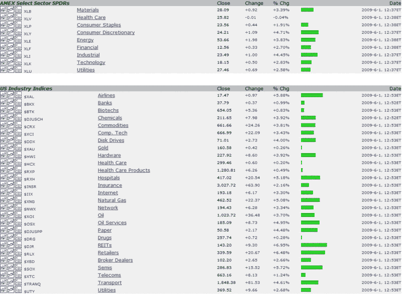

<!--yml
category: 未分类
date: 2024-05-18 17:45:11
-->

# VIX and More: REITs and Retailers Leading Today’s Rally

> 来源：[http://vixandmore.blogspot.com/2009/06/reits-and-retailers-leading-todays.html#0001-01-01](http://vixandmore.blogspot.com/2009/06/reits-and-retailers-leading-todays.html#0001-01-01)

Below I have captured an excerpt of the excellent [StockCharts Market Summary](http://stockcharts.com/charts/summary/) page, which provides a graphical and numerical overview of the day’s action across a wide variety of indices, [sectors](http://vixandmore.blogspot.com/search/label/sectors), geographies and asset classes.

Today I am focusing on the sectors that are leading the rally. These include REITs and retailers, with support from transports, including the air lines. Frankly, there is very little sector weakness across the board, just degrees of strength. While not shown in the graphic below, the [yen](http://vixandmore.blogspot.com/search/label/Yen) is also doing well today.

I am somewhat skeptical that today’s rally will have legs, but as long as the breadth of the rally continues, the odds suggest that a reversal is not a high percentage play.

*[source: StockCharts]*